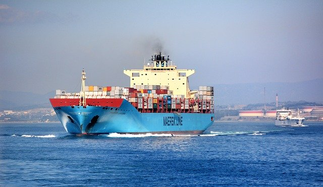

# コンテナ研修

著者: takutaka @ 技術部

## ゴール
以下の内容を持ち帰ってもらえたら研修は終了したことになります。

### コンテナ関連技術に触れることができる

- 自分でコンテナをやってみたい！と思ったときに何をやればいいかが分かる
- 自分でアプリケーションをコンテナを用いて動かすことができる
- コンテナを使う利点と欠点を理解できる

### クラウド関連技術に触れることができる

- AWS を使いたい！と思ったときに何をやればいいかが分かる
- AWS を使って仮想マシンにアクセスできる
- AWS がどんなことができるのかざっくり理解している
- AWS とプライベートクラウドの違いが理解できている
- コードを用いてクラウドを操作できる

### デプロイ関連技術に触れることができる

- コードを用いてデプロイを自動化できる
- デプロイ自動化の利点を手を動かして理解できる

### 標準化、抽象化について実践で使える理解を得られる

- 標準化を実際のプロダクトに適用できる素養を養う
- 抽象化を実際のプロダクトに適用できる素養を養う
---

## 導入

突然ですが、皆さんは今後の人生で、偉大な発明をしたいですか？  
僕は絶対にしたいと思っています。  

偉大な発明、と評される発明はこの世に数多く存在します。  
人類の歴史からたどると、火が発明されたことは偉大でした。  
車輪、蒸気機関、電球、電話、  
最近だとスマホと周辺のエコシステムは世界を変えた偉大な発明と言えると思います。  

その中に共通することはなんでしょうか？  
それは、世の中の仕組みをより良いものに変えたということです。  

偉大な発明のひとつに、「コンテナ」が挙げられます。  
コンテナが世の中の仕組みをどう良くしたか、確認していきましょう。  

## コンテナとは

---

[Wikipedia](https://ja.wikipedia.org/wiki/コンテナ) によると、

> コンテナ (英: container）とは、内部に物を納めるための容器のことである。

とのことです。  

こんな感じのものを皆さんどこかで見たことはあるのではないでしょうか？

### コンテナができる前の世界

コンテナが発明される前は、貨物を運びたい人が独自に運ぶための箱を作ったり、  
貨物船に備え付けの箱に荷物を積み込むという手法を取っていました。  
船のそばまで荷物を持っていって、作業員に中に積み込んでもらいます。  

その際に、いろいろと問題が発生していました。  

- 積み込むために大量の人手が必要になった
  - 労働者を取りまとめるギャングが発達してしまった
  - 労働者による貨物の窃盗が多発してしまった
- 海が荒れている日などは作業ができなかった

いいことないですね。  

また、倉庫→トラック→貨物船→トラック→倉庫  
とたくさん荷物を上げ下げする必要があり、  
その手間も結構大きく大変でした。  

大変だな〜と思ったマルコムさんという人が、ある日思いついたそうです。  
**「荷降ろしせずにトラックごと船に乗っけちゃえばよくない？」** と。

トラックごと乗せると、運転席の部分が無駄になるので、  
貨物部分だけ取り外せるトラックを開発し、  
さらに貨物部分をギチギチに積むことのできる船まで開発しちゃいました。  
これが広く普及したコンテナのはじまりとされているそうです。  

#### その後

マルコムさんは、トラックの荷台にピッタリ合う船を作ってしまいました。  
じゃあ他の人は、マルコムさんの作った「トラックの荷台部分」をそのまま運べる船を作ることができるでしょうか？  

答えはノーです。  
「トラックの荷台部分」がどういう形状、特性を持っているのか、というのはマルコムさんにしかわかりません。  

なので、世界中の人で話し合って、「コンテナはこういう形や特性はこれ！」という基準を定めました。  
これは ISO規格というもので定められており、誰でも参照、利用できる規格となっています。  

### コンテナが解決した課題は？

コンテナが解決した課題を見ていきましょう。  

#### 人力による荷詰めが無くなった

荷物ごとに積み直さないといけなかったため、荷詰め人員は必要でした。  
しかし、積み上げる荷物が同じ大きさのコンテナだけになったおかげで、  
人員による細かな制御は必要なくなり、クレーンによる効率化ができるようになりました。  
人手による荷詰めが無くなったおかげで、問題となっていた窃盗やギャングの横行もなくなりました。  

#### 効率的に荷物が運べるようになった

1万本のバナナを運ぶために、いままで1万回荷物を積み下ろししていたのが、  
コンテナの登場によりコンテナ1個に変わりました。  
そのため、積み下ろしのスピードが飛躍的に向上しました。  

更に、コンテナに合わせた船を作ることにより、  
一艘の船に積み込める荷物の量や種類が飛躍的に増加しました。

#### 規格にピッタリ合わせたソリューションがたくさん生まれた

規格ができたことにより、コンテナが手元になかったとしても  
規格に合わせた全く無駄のない船を作ることができるようになりました。  

また、規格に合わせて作られたコンテナが自動で運べるクレーンや、  
規格に合わせて作られたコンテナの中身を検査する機械等も作成されました。  

結果、 
 **「このコンテナ規格に合わせて作れば僕らの作ったシステムが使えるよ」**  
というエコシステムが醸成されました。 

### Amazon の段ボールに見るコンテナ化

あのやたら大きな箱も、コンテナ化のひとつです。  

様々な大きさの箱がありますが、それぞれの箱で大きさが決まっています。  

総容量と規格化されたダンボール箱の体積からどの箱がどのくらい運べるかを計算し、
トラックの総容量ギリギリまで荷物を詰め込めるようにしています。   
中身の大きさに合わない箱で運ばれたのは、たまたま大きめの規格の箱で空きがあったのでしょう。  

規格化することで、トラックの容量を最大限利用できるだけでなく、  
段ボールの大量発注により製造コストが削減できるというメリットもあります。  
