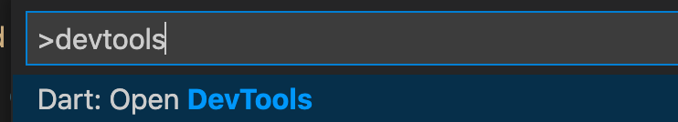
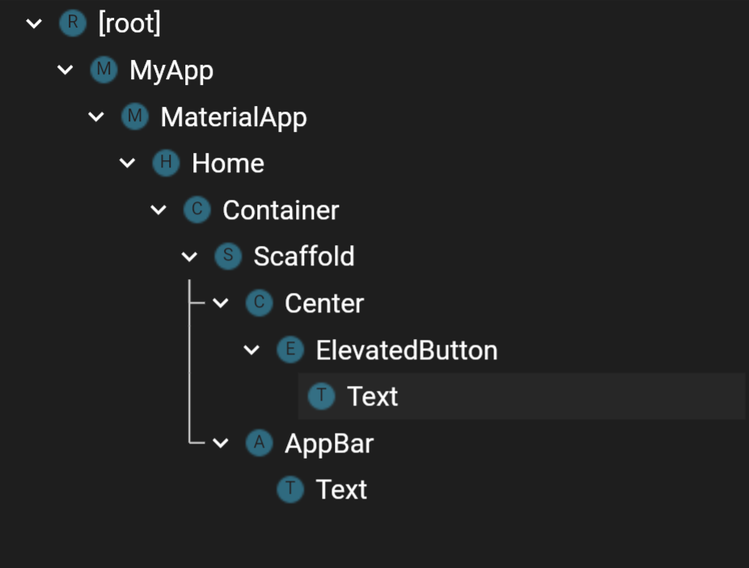
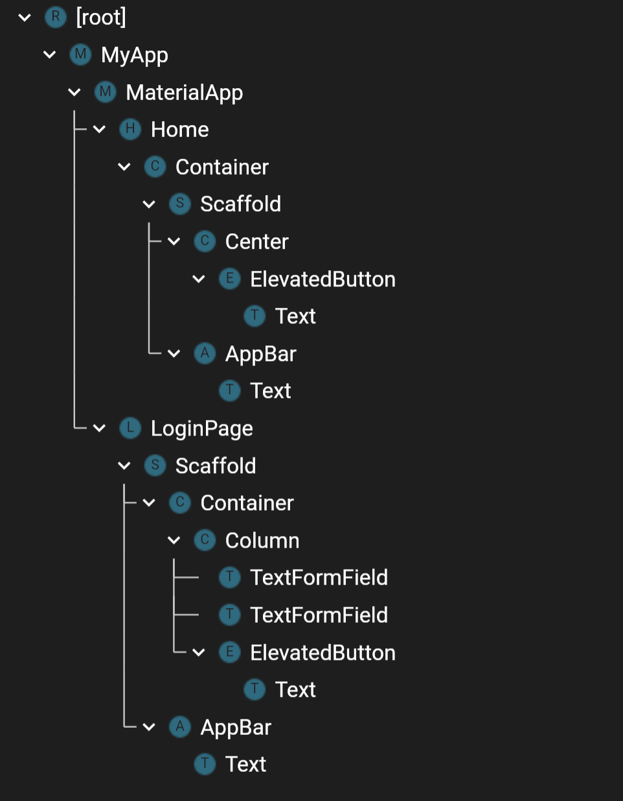
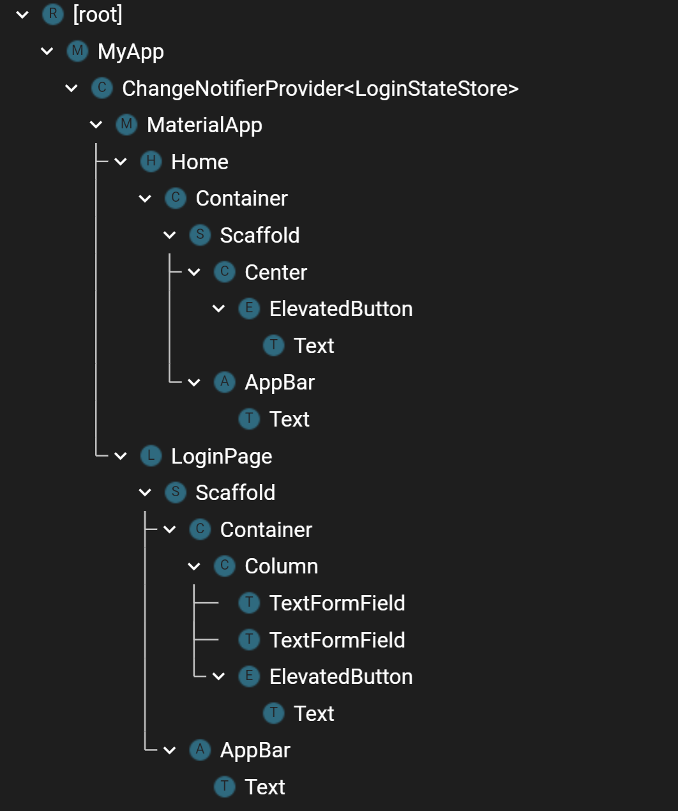
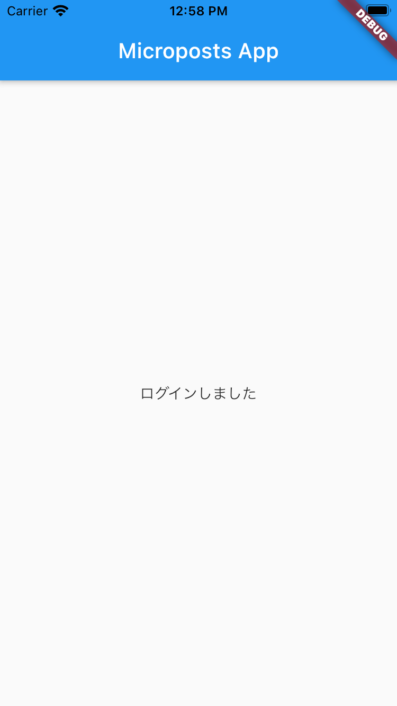
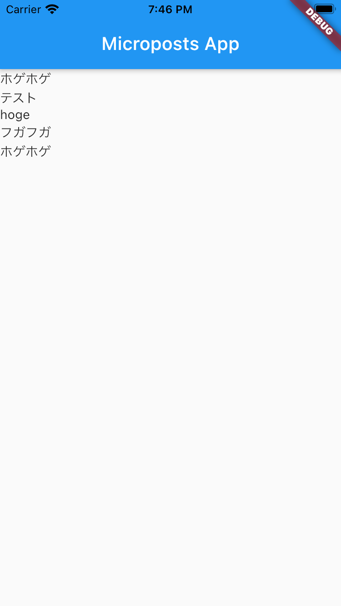
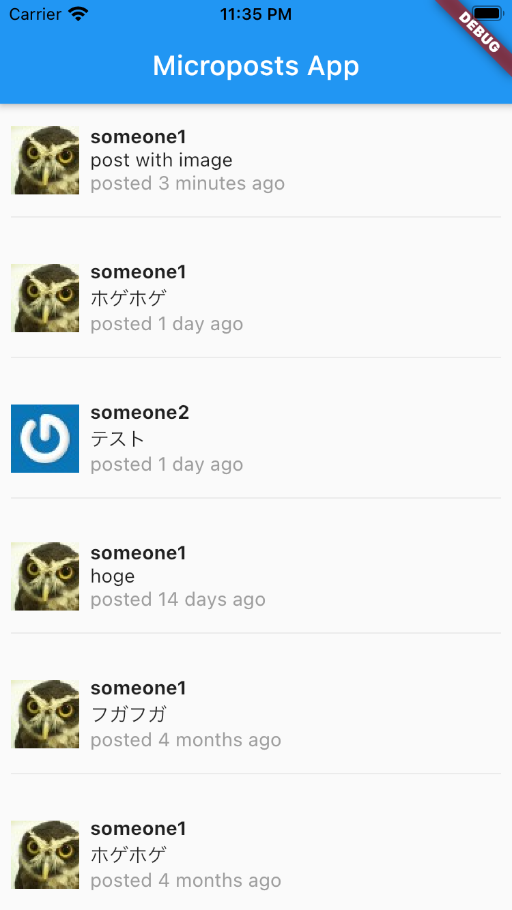

# 29章 Flutterにおけるグローバルな状態の管理

無事アクセストークンの取得ができましたが、このトークンはログインページだけでなく、Feedの取得やMicropostの投稿などにも必要になります。
このような、アプリケーション全体で必要となるグローバルな状態はどのように管理すれば良いのでしょうか。

Flutterには`InheritedWidget`という、下位のウィジェットから上位のウィジェットにアクセスするための特別なウィジェットが用意されています。
この`InheritedWidget`をラップした`provider`というパッケージを使って、ログインページで取得したアクセストークンをグローバルな状態として保管してみましょう。

まずは、`provider`パッケージをインストールします。

```yaml
dependencies:
  provider: ^5.0.0
```

`provider`の使い方には色々ありますが、シンプルな使い方の`ChangeNotifier`と、`ChangeNotifierProvider`を使うことにします。
`ChangeNotifier`は、購読しているウィジェットに対して変更を通知する機能を持ちます。一方で`ChangeNotifierProvider`は、配下のウィジェットに対して、特定の`ChangeNotifier`に対するアクセスする手段を提供してくれるウィジェットです。

今回は、アクセストークンとログイン状態を通知する`LoginStateStore`を作ってみましょう。

```dart
import 'package:flutter/material.dart';

class LoginStateStore extends ChangeNotifier {
  String _accessToken = "";
  String get accessToken => _accessToken;
  bool _loggedIn = false;
  bool get loggedIn => _loggedIn;

  Future<void> login(String accessToken) async {
    assert(accessToken.isNotEmpty, "Access Token must be present.");

    _accessToken = accessToken;
    _loggedIn = true;
    notifyListeners();
  }

  Future<void> logout() async {
    _accessToken = "";
    _loggedIn = false;
    notifyListeners();
  }
}
```

次に、`LoginStateStore`へのアクセスを提供する`ChangeNotifierProvider`を作りますが、その前に画面遷移を伴うウィジェットツリーの構成と、`ChangeNotifierProvider`の性質について少し解説します。

Flutterにはウィジェットの状態を可視化してくれる`Widget Inspector`という機能があります。VSCodeを使っている場合は`Cmd + Shift + P`でコマンドパレットを開き、`devtools`と入力すると表示できます。



アプリを起動した最初の画面では、ウィジェットツリーは以下のような状態になっています。



`MyApp`ウィジェットの配下に、`MaterialApp`, `Home`, `Container`, `Scaffold`と続いているのが分かります。

では次に、ログインボタンを押して、ログイン画面に遷移した状態のウィジェットツリーを確認してみましょう。



この通り、`Home`から遷移した`LoginPage`ウィジェットは、`MaterialApp`の配下に配置されます。

これを踏まえた上で、`provider`の使い方について解説していきます。

`ChangeNotifierProvider`はウィジェットとして機能し、配下のウィジェットに対し`ChangeNotifier`へのアクセス手段を提供してくれます。
この「配下のウィジェットに対し」という点がとても重要になります。先ほど作成した`LoginStateStore`は`LoginPage`ウィジェットからでも、`Home`ウィジェットからでもアクセスしたい`ChangeNotifier`です。これを満たすためには、両方のウィジェットよりも上位のウィジェットとして、`ChangeNotifierProvider`を配置する必要があります。

先ほどのウィジェットツリーを再確認してみましょう。


どちらのウィジェットも、`MaterialApp`の直下に配置されています。そのため、`ChangeNotifierProvider`は`MaterialApp`よりも上位で宣言されている必要があります。

```dart
class MyApp extends StatelessWidget {
  @override
  Widget build(BuildContext context) {
    return ChangeNotifierProvider(
      create: (context) => LoginStateStore(),
      child: MaterialApp(
        title: "MicropostsApp",
        home: Home(),
      ),
    );
  }
}
```

ウィジェットツリーを確認してみましょう。



これで、`Home`, `LoginPage`どちらのウィジェットからも、`LoginStateStore`にアクセスできるようになりました。
それでは、実際にログイン情報を格納してみましょう。

`LoginPage`の`onPressed`に追記していきます。

```dart
import 'dart:convert';
import 'package:flutter/material.dart';
import 'package:microposts_app/login_state_store.dart';
import 'package:microposts_app/validator.dart';
import 'package:flutter_dotenv/flutter_dotenv.dart' as DotEnv;
import 'package:http/http.dart' as http;
import 'package:provider/provider.dart';

// 省略

if (response.statusCode >= 400) {
  final snackBar = SnackBar(
    content: Text("ログインできませんでした。メールアドレスとパスワードが正しいか確認してください。"),
    action: SnackBarAction(
      label: "閉じる",
      onPressed: () {},
    ),
  );
  ScaffoldMessenger.of(context).showSnackBar(snackBar);
} else {
  final accessToken =
      json.decode(response.body)['access_token'].toString();
  final store = context.read<LoginStateStore>();
  await store.login(accessToken);
  Navigator.of(context).pop();
}
```

`provider`経由での`ChangeNotifier`へのアクセスには、主に`context.watch<T>`と`context.read<T>`を使います。どちらもジェネリクスでの呼び出しとなり、取得したい`ChangeNotifier`の型を指定します。

主な違いは、`ChangeNotifier`の値が更新されたことを監視するかどうかです。
`context.watch<T>`では、`ChangeNotifier`の`notifyListeners`をトリガーにウィジェットの再描画を行います。そのため、ウィジェットの`build`メソッド内でのみ使用することができます。`build`メソッド以外で`context.watch<T>`を使おうとすると、実行時エラーが発生します。
一方で`context.read<T>`は`build`メソッド以外で利用します。基本的には`onPressed`, `onChanged`などのコールバックの内部で`ChangeNotifier`へのアクセスを行う際に利用します。

また、Flutterの性質上から`context.watch<T>`経由では`notifyListener`が呼ばれうるメソッドの呼び出しは避ける必要があります。
というのも、`context.watch<T>`は`notifyListener`が呼ばれるとウィジェットの再描画を行いますが、`build`メソッドの実行中にウィジェットの再描画を行おうとすると実行時エラーが発生します。

`LoginPage`での呼び出しは`onPressed`内部で行われるため、`context.read<T>`を使います。
そして、`login`メソッドを通じて`LoginStateStore`にトークンを渡し、ログインします。

`Navigator.of(context).pop()`は`push`によって遷移した画面を閉じ、遷移元の画面に戻ります。
最初の画面に戻ったら、ログイン状態を反映させてみましょう。

`context.watch`で`LoginStateStore`の`loggedIn`を取得すれば、複雑な分岐を書くことなく、ログイン状態/非ログイン状態のウィジェットを出し分けることができます。

```dart
class Home extends StatelessWidget {
  const Home({Key? key}) : super(key: key);

  @override
  Widget build(BuildContext context) {
    final store = context.watch<LoginStateStore>();
    return Container(
      child: Scaffold(
        appBar: AppBar(
          title: Text('Microposts App'),
        ),
        body: store.loggedIn ? _feeds(context) : _loginButton(context),
      ),
    );
  }

  Widget _feeds(BuildContext context) {
    // TODO: APIからフィードを取得して表示する
    return Center(
      child: Text("ログインしました"),
    );
  }

  Widget _loginButton(BuildContext context) {
    return Center(
      child: ElevatedButton(
        child: Text("ログイン"),
        onPressed: () {
          Navigator.of(context).push(MaterialPageRoute(builder: (context) {
            return LoginPage();
          }));
        },
      ),
    );
  }
}
```

`context.watch`経由で参照している`ChangeNotifier`で`notifyListeners`が呼ばれると、そのウィジェットは再描画されます。今回のケースでは、ログイン画面から`login`メソッドによって`loggedIn`の値が更新され、`notifyListeners`が呼ばれるのでそのタイミングで`build`メソッドが再度実行され、`_loginButton`の代わりに`_feed`ウィジェットが描画されるようになります。



これで、アクセストークンを取得してログイン状態を作ることができました。しかし、アプリを再起動すると、ログイン状態は失われてしまいます。Webブラウザではログイン状態をセッションの保存で実現していました。モバイルアプリでは、ローカルストレージにアクセストークンを保存することでログイン状態を保存してみましょう。

`flutter_secure_storage`はデータを安全なストレージに保存する機能を提供するライブラリです。プラットフォームによって安全なストレージの定義は異なりますが、iOSの場合はKeyChainにデータを保存するようです。

```yaml
dependencies:
  ...
  flutter_secure_storage: ^4.2.0
```

それでは、ログイン処理で手に入れたアクセストークンを保存します。`lib/login_page.dart`に追記します。

```dart
final accessToken =
    json.decode(response.body)['access_token'].toString();
final store = context.read<LoginStateStore>();
await store.login(accessToken);
final storage = FlutterSecureStorage();
storage.write(key: "accessToken", value: accessToken);
Navigator.of(context).pop();
```

`storage.write`は`Future<void>`ですが、ログイン処理で書き込みを待つ必要はないので、`await`はつけていません。

保存できるようになったので、次はアプリの起動時にアクセストークンが保存されているか確認し、保存されていたらログイン状態を復元します。

これを実現するには、いくつか考えなければならない点があります。
まず、ローカルストレージへのアクセスは`async`関数で行われます。しかし、ウィジェットが持つ`build`メソッドでは`await`を使うことはできません。
そのため、何らかの手段でローカルストレージの情報取得を待ち、その上で`LoginStateStore`に情報を渡してあげる必要があります。

それを実現するための仕組みとして、`StatefulWidget`の`initState`内部で`WidgetsBinding.addPostFrameCallback`を使ってみましょう。

まずは、`Home`ウィジェットを`StatefulWidget`で作り直します。

```dart
class Home extends StatefulWidget {
  Home({Key? key}) : super(key: key);

  @override
  _HomeState createState() => _HomeState();
}

class _HomeState extends State<Home> {
  @override
  Widget build(BuildContext context) {
    final store = context.watch<LoginStateStore>();
    return Container(
      child: Scaffold(
        appBar: AppBar(
          title: Text('Microposts App'),
        ),
        body: store.loggedIn ? _feeds(context) : _loginButton(context),
      ),
    );
  }
  // 省略
}
```

`_HomeState`内では、`initState`メソッドをオーバーライドできます。

```dart
@override
void initState() {
  super.initState();
}
```

`initState`は`StatefulWidget`の初期化時に一度だけ呼び出されます。注意点として、`initState`自体を`async`関数としてオーバーライドすることはできないので、`.then`を使ってストレージからアクセストークンの取得を待たずに処理を進めるような実装にします。


```dart
@override
void initState() {
  super.initState();
  FlutterSecureStorage().read(key: "accessToken").then((accessToken) {
    if (accessToken != null && accessToken.isNotEmpty) {
      context.read<LoginStateStore>().login(accessToken);
    }
  });
}
```

`context`は`build`メソッドと違い`initState`の引数には入ってきませんが、`State<T>`クラスには`context`のgetterが実装されているため、取得できます。

これで、アプリ起動時にログイン状態を復元できるようになりました。

### アクセストークンを使って情報を取得し、表示する

それでは、実際にAPIからデータを取得して、モバイルアプリで表示してみましょう。

まずはフィードの取得です。フィードは`Micropost`の配列が格納されたJSON取得できます。
具体的には、このような形式です。

```json
[
    {
        "id": 5,
        "content": "hogehoge",
        "created_at_time_ago_in_words": "less than a minute",
        "user": {
            "id": 1,
            "name": "user_one",
            "gravatar_url": "https://secure.gravatar.com/avatar/***",
            "is_current_user": false
        }
    },
```

受け取ったJSONはただの文字列情報なので、Dart上でうまく扱えるように変換します。

`lib/user.dart`と`lib/micropost.dart`を作成します。

```dart
class User {
  final int id;
  final String name;
  final String gravatarURL;
  final int? followingCount;
  final int? followersCount;
  final bool isCurrentUser;

  User(
    this.id,
    this.name,
    this.gravatarURL,
    this.followingCount,
    this.followersCount,
    this.isCurrentUser,
  );

  factory User.fromJSON(Map<String, dynamic> json) {
    return User(
      json['id'] as int,
      json['name'] as String,
      json['gravatar_url'] as String,
      json['following_count'] as int?,
      json['followers_count'] as int?,
      json['is_current_user'] as bool,
    );
  }
}

```

```dart
import 'package:microposts_app/user.dart';

class Micropost {
  final int id;
  final String content;
  final String createdAtTimeAgoInWords;
  final User user;

  Micropost(
    this.id,
    this.content,
    this.createdAtTimeAgoInWords,
    this.user,
  );

  factory Micropost.fromJSON(Map<String, dynamic> json) {
    return Micropost(
      json['id'] as int,
      json['content'] as String,
      json['created_at_time_ago_in_words'] as String,
      User.fromJSON(json['user']),
    );
  }
}
```

`fromJSON`はFactoryメソッドです。これはクラスのオブジェクトを生成するコンストラクタの一つと考えて差し支えありません。
`fronJSON`では、`Map<String, dynamic>`で表現されるJSONを受け取り、それを元にオブジェクトを組み立てるような実装になっています。

モデルクラスの実装ができたので、実際にAPIにリクエストを送信し、フィードを取得してみましょう。

`lib/feed_store.dart`を作成します。

```dart
import 'dart:convert';
import 'dart:io';

import 'package:flutter/material.dart';
import 'package:http/http.dart' as http;

import 'package:microposts_app/micropost.dart';

class FeedStore extends ChangeNotifier {
  List<Micropost> _microposts = [];
  List<Micropost> get microposts => _microposts;

  Future<void> fetchFeeds(String token) async {
    final client = http.Client();
    final url = Uri.http("localhost:3000", "/api/v1/feeds.json");
    final response = await client.get(url,
        headers: {HttpHeaders.authorizationHeader: "Bearer ${token}"});
    if (response.statusCode < 400) {
      final decoded = json.decode(response.body);
      final microposts = (decoded as List)
          .map<Micropost>((obj) => Micropost.fromJSON(obj))
          .toList();
      this._microposts = microposts;
      notifyListeners();
    } else if (response.statusCode < 500) {
      throw Exception("フィードを取得できませんでした。");
    } else {
      throw Exception("フィードを取得できませんでした。サーバーに問題があるようです。");
    }
  }

  Future<void> clearFeeds() async {
    this._microposts = [];
    notifyListeners();
  }
}
```

`lib/main.dart`, `lib/login_page.dart`を変更して、初回のアクセストークン取得時とログイン時に、フィードを取得してみましょう。
注意点として、`FeedStore`は新しく作成された`ChangeNotifier`であるため、`ChangeNotiiferProvider`経由で下位のウィジェットからアクセスできるように変更する必要があります。
複数の`ChangeNotifierProvider`を記述しやすくするために、`MultiProvider`という便利な機能を使います。

```dart
class MyApp extends StatelessWidget {
  @override
  Widget build(BuildContext context) {
    return MultiProvider(
      providers: [
        ChangeNotifierProvider(
          create: (context) => LoginStateStore(),
        ),
        ChangeNotifierProvider(
          create: (context) => FeedStore(),
        ),
      ],
      child: MaterialApp(
        title: "MicropostsApp",
        home: Home(),
      ),
    );
  }
  // 省略
}

class _HomeState extends State<Home> {
  @override
  void initState() {
    super.initState();
    FlutterSecureStorage().read(key: "accessToken").then((accessToken) async {
      if (accessToken != null && accessToken.isNotEmpty) {
        await context.read<LoginStateStore>().login(accessToken);
        context.read<FeedStore>().fetchFeeds(accessToken);
      }
    });
  }
  // 省略
}
```

```dart
class _LoginPageState extends State<LoginPage> {
  //　省略

  Widget _loginButton(BuildContext context) {
          // 省略
          if (response.statusCode >= 400) {
            final snackBar = SnackBar(
              content: Text("ログインできませんでした。メールアドレスとパスワードが正しいか確認してください。"),
              action: SnackBarAction(
                label: "閉じる",
                onPressed: () {},
              ),
            );
            ScaffoldMessenger.of(context).showSnackBar(snackBar);
          } else {
            final accessToken =
                json.decode(response.body)['access_token'].toString();
            final store = context.read<LoginStateStore>();
            await store.login(accessToken);
            final storage = FlutterSecureStorage();
            await storage.write(key: "accessToken", value: accessToken);
            // FeedStoreに取得を依頼する
            final feedStore = context.read<FeedStore>();
            await feedStore.clearFeeds();
            feedStore.fetchFeeds(accessToken);
            Navigator.of(context).pop();
          }
        },
        child: Text("ログイン"),
      );
    }
```

これで、ログイン状態になった時に、フィードを取得できるようになりました。
取得できたフィードを、実際に画面に表示します。

```dart
class _HomeState extends State<Home> {
  // 省略
  Widget _feeds(BuildContext context) {
    final microposts = context.watch<FeedStore>().microposts;
    return ListView.builder(
        itemCount: microposts.length,
        itemBuilder: (BuildContext context, int index) {
          return _timelineListItem(context, microposts[index]);
        });
  }

  Widget _timelineListItem(BuildContext context, Micropost micropost) {
    return Text(micropost.content);
  }
```

`_feeds`で、フィード情報を含むウィジェットを返すように変更します。
ここでは`ListView`ウィジェットを返しています。`ListView.builder`は`itemCount` (ここでは`microposts`)の数だけ`itemBuilder`を使ってウィジェットを生成し、リスト表示してくれます。
`itemBuilder`の`index`は`itemCount`の回数だけインクリメントされるため、`microposts[index]`を指定することで格納された全ての要素に応答するウィジェットが生成されます。

`_timelineListItem`自体はシンプルな作りで、渡された`micropost`の`content`を表示しています。



これで、アプリの画面でフィードを表示できました。

次は、`content`を表示していただけのフィードの見た目を整え、便利にしていきましょう。
`lib/main.dart`の`_timelineListItem`を編集します。

```dart
Widget _timelineListItem(BuildContext context, Micropost micropost) {
  return Container(
    padding: EdgeInsets.all(8),
    child: Column(
      children: [
        Container(
          padding: EdgeInsets.only(top: 8, bottom: 8),
          child: Row(
            children: [
              Padding(
                padding: EdgeInsets.only(right: 8),
                child: Image.network(micropost.user.gravatarURL),
              ),
              Column(
                crossAxisAlignment: CrossAxisAlignment.start,
                children: [
                  Text(
                    micropost.user.name,
                    style: TextStyle(fontWeight: FontWeight.bold),
                  ),
                  Text(
                    micropost.content,
                    maxLines: null,
                  ),
                  Text(
                    "posted ${micropost.createdAtTimeAgoInWords} ago",
                    style: TextStyle(color: Colors.grey),
                  ),
                ],
              )
            ],
          ),
        ),
        Divider(),
      ],
    ),
  );
}
```

ここでは、`Column`, `Row`を組み合わせてフィードの見た目を構築しています。

ユーザー名・コンテンツの内容・投稿時間を表示するために使われている`Column`に渡されている`crossAxisAlignment: CrossAxisAlignment.start`がポイントです。

`Column`と`Row`にはそれぞれ、`mainAxisAlignment`と`crossAxisAlignment`というパラメータがあり、ウィジェットが積み重なる方向を`main`, それと直交する方向を`cross`と定義しています。
この`AxisAlignment`は`Column`, `Row`に渡されたウィジェットの配置される位置を指定できます。

今回のケースでは、`crossAxisAlignment: CrossAxisAlignment.start`と指定しているため、`Column`の`cross`方向の`start`を起点にしてウィジェットを配置することになります。

Alignmentの詳細について知りたい方は、以下の記事を参照してみると良いでしょう。
https://flutter.dev/docs/development/ui/layout#aligning-widgets


