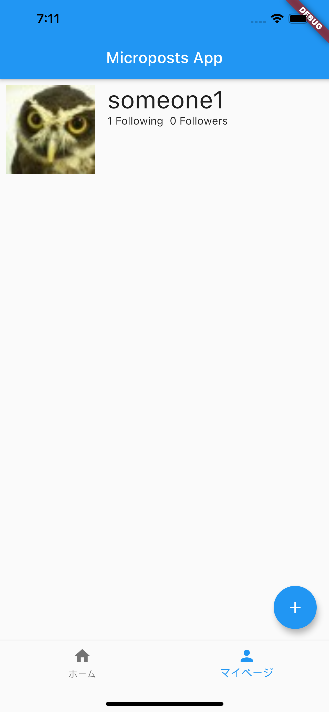

# 30章 Bottom Navigation Barで複数の画面を出し分ける

フィードの表示ができたので、次はマイページを表示できるようにしてみます。
Bottom Navigation Barを使って、簡単にアクセスできるようにしてみましょう。

https://material.io/components/bottom-navigation

Flutterでは、`Scaffold`に`bottomNavigationBar`を指定できます。
`bottomNavigationBar`は`BottomNavigationBar`ウィジェットを取り、さらにこのウィジェットは`items`という引数を取ります。これには`List<BottomNavigationBarItem>`を渡すことができ、画面下部に表示したいコンテンツの数だけ`BottomNavigationBarItem`を記述します。
また、`BottomNavigationBar`はコンテンツがタップされた際に発火する`onTap`コールバックを指定できます。デフォルトでは、単純にタップしただけでは何も起こらないので、タップしたら画面を切り替えられるようにしてみましょう。

`Home`ウィジェットは`StatefulWidget`なので、現在表示している画面は`_currentIndex`という状態として持ってみます。

```dart
import 'package:microposts_app/my_page.dart';

class _HomeState extends State<Home> {
  int _selectedIndex = 0;

  // 省略
  @override
  Widget build(BuildContext context) {
    final store = context.watch<LoginStateStore>();
    if (!store.loggedIn) {
      return Scaffold(
        appBar: AppBar(
          title: Text('Microposts App'),
        ),
        body: _loginButton(context),
      );
    }

    final _widgets = [_feeds(context), MyPage()];

    return Container(
      child: Scaffold(
        appBar: AppBar(
          title: Text('Microposts App'),
        ),
        // _selectedIndexによって表示するウィジェットを変える
        body: _widgets[_selectedIndex],
        bottomNavigationBar: BottomNavigationBar(
          items: [
            BottomNavigationBarItem(icon: Icon(Icons.home), label: "ホーム"),
            BottomNavigationBarItem(icon: Icon(Icons.person), label: "マイページ"),
          ],
          currentIndex: _selectedIndex,
          // indexにはタップしたコンテンツの番号が格納される
          onTap: (int index) {
            // StatefulWidgetが持つ状態は、setState()の内部で変更する
            setState(() {
              this._selectedIndex = index;
            });
          },
        ),
      ),
    );
  }
```

`lib/my_page.dart`を作成し、`MyPage`ウィジェットを作成します。

```dart
import 'package:flutter/material.dart';

class MyPage extends StatelessWidget {
  @override
  Widget build(BuildContext context) {
    return Center(
      child: Text("マイページ"),
    );
  }
}

```

これで、BottomNavigationBarのコンテンツをタップするたびに画面を切り替えられるようになりました。
しかし、まだマイページを表示するためのユーザー情報がありません。
`/api/v1/users/self`にアクセスし、ログインしているユーザーの情報を取得して`LoginStateStore`に格納します。

`lib/login_state_store.dart`, `lib/my_page.dart`を編集します。


```dart
import 'dart:convert';
import 'dart:io';

import 'package:flutter/material.dart';
import 'package:http/http.dart' as http;

import 'package:microposts_app/user.dart';

class LoginStateStore extends ChangeNotifier {
  // 省略
  User? _currentUser = null;
  User? get currentUser => _currentUser;

  Future<void> login(String accessToken) async {
    assert(accessToken.isNotEmpty, "Access Token must be present.");
    final uri = Uri.http("localhost:3000", "/api/v1/users/self.json");
    final client = http.Client();
    final headers = {HttpHeaders.authorizationHeader: "Bearer ${accessToken}"};
    final response = await client.get(uri, headers: headers);

    if (response.statusCode < 400) {
      final decoded = json.decode(response.body);
      final user = User.fromJSON(decoded);
      _currentUser = user;
    } else {
      throw Exception("ログインユーザーの情報が取得できませんでした。");
    }

    _accessToken = accessToken;
    _loggedIn = true;
    notifyListeners();
  }
}
```

```dart
import 'package:flutter/material.dart';
import 'package:microposts_app/login_state_store.dart';
import 'package:microposts_app/user.dart';
import 'package:provider/provider.dart';

class MyPage extends StatelessWidget {
  @override
  Widget build(BuildContext context) {
    final currentUser = context.watch<LoginStateStore>().currentUser;
    return currentUser == null
        ? Center(
            child: Text("マイページ"),
          )
        : _myPageContent(context, currentUser);
  }

  Widget _myPageContent(BuildContext context, User currentUser) {
    return Column(
      children: [
        Padding(
          padding: EdgeInsets.all(8),
          child: Row(
            crossAxisAlignment: CrossAxisAlignment.start,
            children: [
              Image.network(
                currentUser.gravatarURL,
                scale: 0.1,
                height: MediaQuery.of(context).size.height / 8,
              ),
              Padding(
                padding: EdgeInsets.only(left: 16),
                child: Column(
                  crossAxisAlignment: CrossAxisAlignment.start,
                  children: [
                    Text(
                      currentUser.name,
                      style: TextStyle(fontSize: 32),
                    ),
                    Row(
                      mainAxisAlignment: MainAxisAlignment.spaceBetween,
                      children: [
                        Text("${currentUser.followingCount} Following"),
                        Text("${currentUser.followersCount} Followers"),
                      ],
                    ),
                  ],
                ),
              ),
            ],
          ),
        )
      ],
    );
  }
}
```

これで、マイページが作れました。



### 課題

マイページにログアウトボタンを追加し、ログアウトできるようにしてみましょう。

ヒント：
<details>
ログイン状態は`LoginStateStore`に格納されているため、その情報をリセットした上で各ウィジェットに状態の更新を伝達してあげると良いでしょう。
</details>
