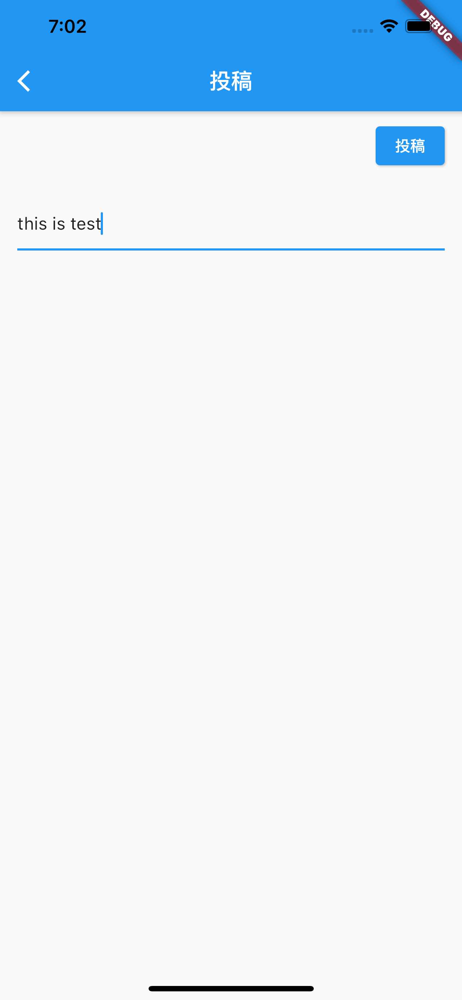

# 31章 マイクロポストを投稿する

最後に、投稿画面を作ってmicropostを投稿できるようにしましょう。

Floating Action Buttonを押したら投稿画面を開くようにしてみます。
`lib/post_page.dart`を作りましょう。

```dart
import 'package:flutter/material.dart';
import 'package:flutter/services.dart';
import 'package:microposts_app/feed_store.dart';
import 'package:microposts_app/login_state_store.dart';
import 'package:provider/provider.dart';

class PostPage extends StatelessWidget {
  const PostPage({Key? key}) : super(key: key);

  @override
  Widget build(BuildContext context) {
    final _controller = TextEditingController();
    return Scaffold(
      appBar: AppBar(
        title: Text("投稿"),
      ),
      body: Column(
        mainAxisAlignment: MainAxisAlignment.start,
        children: [
          Container(
            padding: EdgeInsets.only(right: 16, top: 8, bottom: 8),
            alignment: Alignment.bottomRight,
            child: ElevatedButton(
                onPressed: () async {
                  final content = _controller.text;
                  if (content.isEmpty) return;

                  final store = context.read<FeedStore>();
                  await store
                      .post(
                          content, context.read<LoginStateStore>().accessToken)
                      .catchError((e) {
                    final snackBar = SnackBar(
                      content: Text(e.message),
                      action: SnackBarAction(
                        label: "閉じる",
                        onPressed: () {},
                      ),
                    );
                    ScaffoldMessenger.of(context).showSnackBar(snackBar);
                  });
                  // Navigator.popは返り値を含めることができる
                  // 返り値はNavigator.pushの呼び出し元で受け取る
                  Navigator.of(context).pop(true);
                },
                child: Text("投稿")),
          ),
          Container(
            padding: EdgeInsets.all(16),
            height: 200,
            child: TextField(
              keyboardType: TextInputType.multiline,
              maxLines: null,
              // TextEditingControllerをTextFieldに渡すことで、入力されたテキストをTextField以外も取得できる
              controller: _controller,
            ),
          ),
        ],
      ),
    );
  }
}
```

`PostPage`では`FeedStore`に投稿するデータを送っています。`post`メソッドを作り、投稿できるようにします。

```dart
class PostFailedException implements Exception {
  final String message;
  PostFailedException(this.message);
}

class FeedStore extends ChangeNotifier {
  // 省略

  Future<void> post(String content, String token) async {
    final url = Uri.http("localhost:3000", "/api/v1/microposts.json");
    final client = http.Client();
    final body = {"content": content};
    final response = await client.post(url, body: json.encode(body), headers: {
      HttpHeaders.contentTypeHeader: "application/json",
      HttpHeaders.authorizationHeader: "Bearer ${token}"
    });

    if (response.statusCode >= 500) {
      throw PostFailedException("投稿に失敗しました。サーバに問題があるようです。");
    } else if (response.statusCode >= 400) {
      throw PostFailedException("投稿に失敗しました。");
    }
  }
}
```

最後に、`lib/main.dart`にFloating Action Buttonを追加します。

```dart
class _HomeState extends State<Home> {
  // 省略
  @override
  Widget build(BuildContext context) {
    // 省略
    return Container(
      child: Scaffold(
        // 省略
        // ScaffoldにFloatingActionButtonを渡す
        floatingActionButton: FloatingActionButton(
          onPressed: () async {
            Navigator.of(context)
                .push(MaterialPageRoute(builder: (BuildContext context) {
              return PostPage();
            })).then((posted) async {
              // postedはPostPageのNavigator.popから渡される
	      // nullableなのでnull checkが必要
              if (posted != null && posted) {
                final store = context.read<FeedStore>();
                await store.clearFeeds();
                store.fetchFeeds(context.read<LoginStateStore>().accessToken);
              }
            });
          },
          child: Icon(Icons.add),
        ),
      ),
    );
  }
}
```



これで、ログイン、フィードの取得、マイページの表示、投稿といった、必要な一通りの機能を持ったアプリが作れました。


## 追加課題

ここまでできた方は、以下の機能にもチャレンジしてみましょう。

- Pull to refresh(引っ張って更新)でフィードを更新できるようにする
- Micropostに画像が添付されていたら、表示する
- マイページで自分のMicropost一覧を表示する
- フォロー・フォロワー一覧画面を表示する
- フィードの下端に到達したら、次のフィードを取得して表示する
