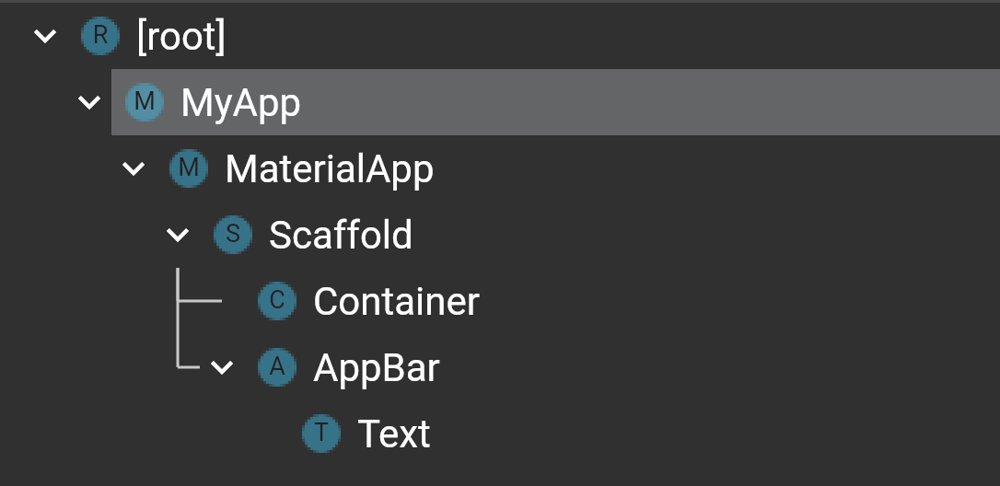
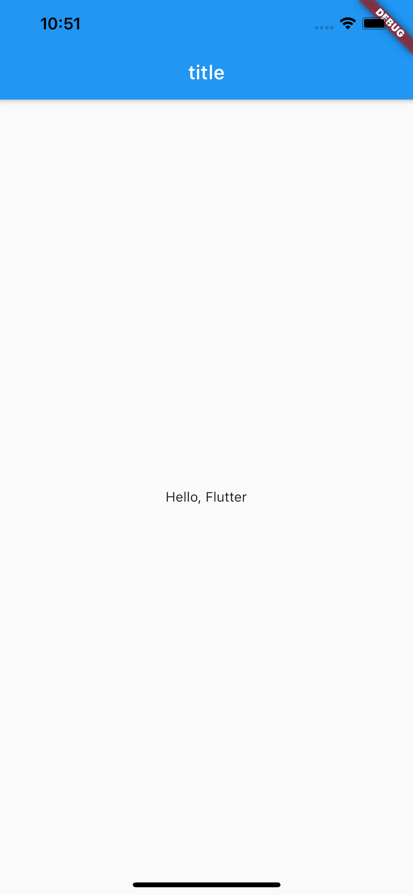
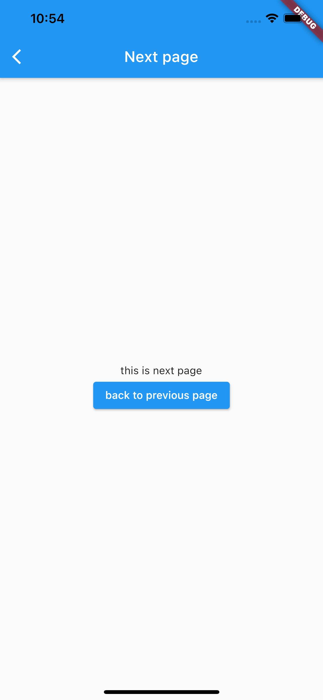
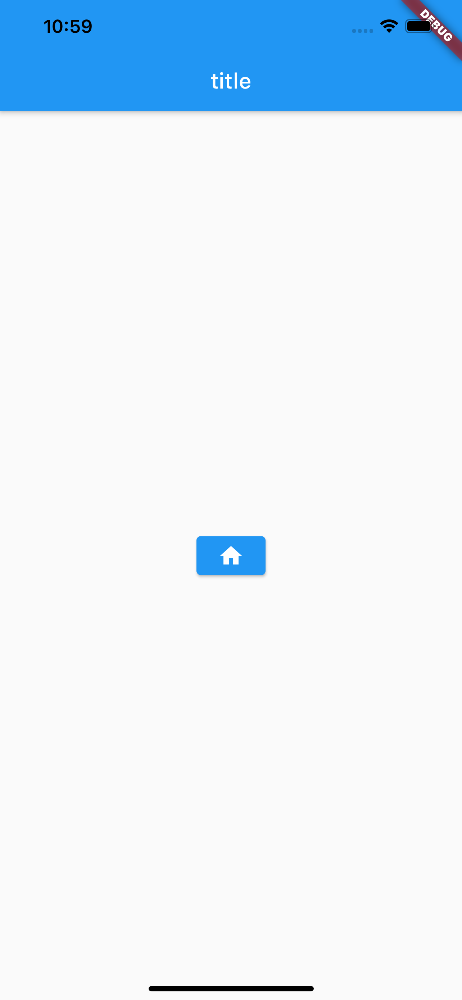

# 3章 ウィジェットを用いた基本的なアプリ開発

## Flutterの開発環境構築

Flutterを用いてモバイルアプリを開発するにあたり、開発環境を整備していきましょう。
この資料では macOS での環境整備について説明していきます。

Linux, Windows を使っている方は、以下のドキュメントに沿ってインストールを行ってください。

- [Windows Install](https://flutter.dev/docs/get-started/install/windows)
- [Linux Install](https://flutter.dev/docs/get-started/install/linux)

開発はVSCode か Android Studio で行えます。お好みのものを使いましょう。

### 記載時の環境

macOS 11.4

### Flutter SDK のインストール

以下のページから、Flutter SDK をインストールします。

[Flutter Install](https://flutter.dev/docs/get-started/install/macos)

iOS / Android それぞれの環境でアプリをビルドできるようにするには、Xcode と Android Studio のインストールとセットアップが必要になります。このハンズオンの内容は特定のプラットフォームに依存してないので、どちらか好きな方を選ぶと良いでしょう。(このハンズオンは iOS をターゲットとして説明していきます）

`flutter doctor`コマンドで、実行したい環境に対して警告が出なくなれば OK です。

```bash
$ flutter doctor
Doctor summary (to see all details, run flutter doctor -v):
[✓] Flutter (Channel stable, v1.12.13+hotfix.9, on Mac OS X 10.14.5 18F203, locale ja-DE)

[✓] Android toolchain - develop for Android devices (Android SDK version 28.0.3)
[✓] Xcode - develop for iOS and macOS (Xcode 11.2.1)
[✓] Android Studio (version 3.5)
[✓] VS Code (version 1.44.2)
[✓] Connected device (1 available)

• No issues found!
```

VS Code と VS Code の Flutter Plugin のインストールは Flutter の開発に必須ではありませんが、開発に便利な機能が揃っているのでインストールすることをお勧めします。

#### 警告が消えない場合

`Connected device`の項目で警告が出ることがあるかもしれません。iOS/Android シミュレータを起動することで警告が出なくなります。

```bash
$ flutter doctor
Doctor summary (to see all details, run flutter doctor -v):
[✓] Flutter (Channel stable, v1.12.13+hotfix.9, on Mac OS X 10.14.5 18F203, locale ja-DE)

[✓] Android toolchain - develop for Android devices (Android SDK version 28.0.3)
[✓] Xcode - develop for iOS and macOS (Xcode 7076811.2.1)
[✓] Android Studio (version 3.5)
[✓] VS Code (version 1.44.2)
[!] Connected device
    ! No devices available

! Doctor found issues in 1 category.

# 以下のコマンドでiOSシミュレータを起動
$ open -a Simulator
```

## Flutter におけるウィジェット

1章でも説明した通り、 Flutter ではウィジェットを組み合わせて UI を構成していきます。
この章では、ベースとなる3つのウィジェットとよく使われるウィジェットを解説したあと、それらを組み合わせたサンプルアプリを作っていきます。

## ウィジェットツリー

再三同じことを書きますが、 Flutter はウィジェットを組み合わせて UI を構成していきます。
では、この**ウィジェットを組み合わせる**とは、具体的にどのような状態を指すのでしょうか。

ウィジェットは以下のように HTML と似たような、ウィジェットツリーと呼ばれるツリー構造を取ります。



`[root]` の直下に配置されている `MyApp` がウィジェットツリーの最上位に配置され、その配下に `MaterialApp`, `Scaffold`, `Container` と続きます。
そしてこれらは全てウィジェットで構成されます。


## ベースとなるウィジェット

Flutter のウィジェットを分類すると、大きく4つに分けることができます。

### StatelessWidget

StatelessWidget とは、名前の通り状態を持たないウィジェットです。
Flutter の特徴である宣言的UIプログラミングの恩恵を最も受けやすく、ライフサイクルも単純なので、ウィジェットを自作する際はまず StatelessWidget を利用することを検討すると良いでしょう。

使い方は簡単で、 `extends` キーワードを使い StatelessWidget を継承します。

```dart
class MyWidget extends StatelessWidget
```

また、 StatelessWidget を継承したウィジェットを作るためには、以下の要件を満たす必要があります。

- フィールドが全て `final` で宣言されていること
- `Widget build(BuildContext context)` をオーバーライドして実装すること

#### フィールドが全て `final` で宣言されていること

`StatelessWidget` は `Widget` クラスを継承しており、 `Widget` クラスには `@immutable` アノテーションが付与されています。 `@immutable` が付与されていると、 `final` で宣言されていないフィールドがクラス内に存在している場合に警告が表示されます。

https://github.com/flutter/flutter/blob/c12b53e07336fcc2b0df9422b70e15bf5db7342c/packages/flutter/lib/src/widgets/framework.dart#L312
https://github.com/dart-lang/sdk/blob/cfa35be6f03d7bca902d66f1497cc7f71edb3c3f/pkg/meta/lib/meta.dart#L117

```dart
class MyWidget extends StatelessWidget {
  final String title;
  // count は final で宣言されていないため、警告が表示される
  int count;

  MyWidget(this.title, {this.count = 0});
}
```

#### `Widget build(BuildContext context)` をオーバーライドして実装すること

`build` メソッドはウィジェットを自作する上で重要な役割を果たします。このウィジェットは、 Flutter がウィジェットの描画をする際に利用します。
メソッド返り値の型からも分かる通り、何らかの `Widget` 型を返す必要があります。
自作した他のウィジェットを `return` しても良いですし、ビルトインのウィジェット(例えば、 `Text` など)を返しても良いです。

```dart
class MyWidget extends StatelessWidget {
  // メソッドをオーバーライドする際は @override アノテーションを付与する
  @override
  Widget build(BuildContext context) {
    return Text("This is StatelessWidget.");
  }
}
```

`BuildContext` は名前の通りウィジェットのビルドを行う際のコンテキストが格納されていて、 Flutter フレームワーク側が勝手に生成してくれ渡してくれるものです。現時点では気にしなくて大丈夫です。

`build` メソッドの注意点として、**アプリの実行中に何度も呼ばれ得る**ことが挙げられます。これは StatelessWidget に限らず、全てのウィジェットが持つ `build` メソッド共通の注意点となります。

`build` メソッドが呼ばれるタイミングはある程度予測できますが、基本的には Flutter 側が勝手に呼び出してくるので、副作用を伴うコードを `build` メソッドの中に記述してしまうと、思わぬ結果を引き起こしてしまうことがあります。
例えばとある API へのリクエストを実行する処理を記述していた場合、ウィジェットが再描画される度にリクエストが発行されてしまい、 API のレートリミットに引っかかってしまう危険性が高まります。

画面の初回描画時にのみ何かを実行したい場合は、後述する StatefulWidget を使うのが良いでしょう。

### StatefulWidget

StatelessWidget とは対象に、状態を持つウィジェットです。
使い方は StatelessWidget と比較すると複雑です。

```dart
class MyWidget extends StatefulWidget {
  final String title;
  MyWidget({this.title, Key key}): super(key: key);

  @override
  _MyWidgetState createState() => _MyWidgetState("before tapping.");
}

class _MyWidgetState extends State<MyWidget> {
  String title;
  _MyWidgetState({this.title});

  @override
  void initState((){
    super.initState();
  });

  @override
  Widget build(BuildContext context) {
    return Column(
      children: [
        Text(title),
        RaisedButton(
          onPressed: () {
            setState(() {
              this.title = "button tapped.";
            });
          },
          child: Text("Tap Me"),
        ),
      ],
    );
  }
}
```

### InheritedWidget

ウィジェットツリー配下のウィジェットに、自身が持っている情報を伝達できるウィジェットです。
便利ではあるのですが使い方にやや癖があり、自作する機会は少ないためここでは紹介に留めます。

6章で使用する `Provider` というライブラリは、この `InheritedWidget` をラップして使いやすくしてくれます。

### RenderObjectWidget

画面の描画を行うウィジェットです。 `Text` などのビルトインウィジェットは `RenderObjectWidget` を継承していることが多いです。
このウィジェットを自作することもできますが、基本的にはすでに用意されているものを使うことが多いです。

## よく使われるビルトインウィジェット

### Text

文字を表示するウィジェットです。 `style` に `TextStyle` を渡すことで、文字にスタイルを付与できます。

```dart
Text("hello World", style: TextStyle(fontSize: 32, fontWeight: FontWeight.bold,));
```

### Container

`child` を取り、子要素のウィジェットにデザインやサイズを与えることができます。
Flutter には `Container` のように、画面には直接表示されない代わりに子要素に何らかのデザインや機能を提供するウィジェットが数多く存在します。

```dart
Container(
  child: Text("Hello World"),
  height: 20,
  width: 40,
)
```

`child` を取らずに使用することもでき、その場合は特に何も表示をしないウィジェットとなります。
Flutterでは `Widget` を渡すべき箇所で `null` を渡してしまうとエラーになってしまうことがあり、そのような場合に空の Container を使用します。

```dart
class MyWidget extends StatelessWidget {
  final List<User> users;

  MyWidget({@required this.users});

  @override
  Widget build(BuildContext context) {
    if (users.length == 0) {
      // build メソッドは必ず null ではない Widget を返す必要がある
      return Container();
    }

    return Column(children:[
        users.map(user => Text(user.name));
      ],
    );
  }
}
```

### Column

`children` に複数のウィジェットを渡すと、縦方向に並べてくれるウィジェットです。
注意点として、高さが `infinity` なサイズのウィジェットを `children` に指定してしまうと実行時エラーが発生します。
これはColumnが `children` のウィジェットが持つ大きさから自身のサイズを可変させる性質を持っており、 `infinity` という高さを持つウィジェットがあった場合は自身のサイズを決定できなくなることによって発生します。

`infinity` のサイズを持つウィジェットは、可能な限りウィジェットの高さ/幅を大きくします。

```dart
Column(
  children: [
    Text("This size is limited."),
    Container(
      child: Text("this size is infinity."),
      height: double.infinity,
    )
  ],
),
```

```bash
══╡ EXCEPTION CAUGHT BY RENDERING LIBRARY ╞═════════════════════════════════════════════════════════
The following assertion was thrown during performLayout():
BoxConstraints forces an infinite height.
These invalid constraints were provided to RenderParagraph's layout() function by the following
function, which probably computed the invalid constraints in question:
RenderConstrainedBox.performLayout
The offending constraints were:
  BoxConstraints(0.0<=w<=360.0, h=Infinity)
```

### Row

`Column` は縦方向であったのに対し、 `Row` は横方向にウィジェットを並べる機能を提供します。
`Column` と同様に、横方向に `infinity` のサイズが指定されているウィジェットを `children` に指定すると実行時エラーが発生します。

### Image

画像を表示するウィジェットです。画像のソースはローカルストレージや画像のURLを指定できます。

```dart
const Image(
  image: NetworkImage('https://d1q9av5b648rmv.cloudfront.net/765x765/t-shirt/s/white/front/4/1395818061-2520x2992.png.jpg?h=54648d20d8276fe8433523e3ba2aacabeadb91c5&printed=true'),
)
```

### Icon

アイコンを表示するウィジェットです。

```dart
Icon(
  Icons.arrow_drop_down,
),
```

使用できるアイコンは[こちらのページ](https://api.flutter.dev/flutter/material/Icons-class.html)から検索できます。

### Scaffold

マテリアルデザインな見た目の画面を簡単に作れるウィジェットです。
Flutter では、1枚の画面を作る際にこの `Scaffold` ウィジェットを最上位のウィジェットとして用いることがとても多いです。

`Scaffold` は様々な引数を取りますが、 `appBar` と `body` が特に重要です。
`appBar` は画面上部のバーを、 `body` は画面のメインコンテンツを指します。

```dart
class HomePage extends StatelessWidget {
  @override
  Widget build(BuildContext context) {
    return Scaffold(
      appBar: AppBar(title: Text("Sample Page"),),
      body: Center(
        child: Text("Hello World"),
      ),
    );
  }
}
```

## ウィジェットを組み合わせてUIを作ってみよう

それでは、これまでの知識を活用して簡単なアプリを作ってみましょう。
まずは `flutter create` コマンドで新しいアプリを作成します。

```bash
$ flutter create app
# 生成されたアプリをIDEで開く
```

Flutter アプリのエントリポイントは、デフォルトで `lib/main.dart` の `void main()` が使用されます。
ファイルを開くとスケルトンコードが生成されていますが、使わないので全て消しておきます。

それでは、簡単なアプリを作っていきます。

```dart
import 'package:flutter/material.dart';

void main() {
  runApp(App());
}

class App extends StatelessWidget {
  @override
  Widget build(BuildContext context) {
    return MaterialApp(
      home: Scaffold(
        appBar: AppBar(
          title: Text('title'),
        ),
        body: Center(
          child: Text("Hello, Flutter"),
        ),
      ),
    );
  }
}
```

まずは上記のコードを記述した上で、アプリを起動してみましょう。`Hello, Flutter`と画面中央に表示されるだけのアプリが立ち上がるでしょう。



しかし、これだけでもいくつかのウィジェットを組み合わせて作られています。一つずつ紐解いてみることにします。

まず、Flutterのアプリは`void main()`がエントリポイントとなります。Flutterではこの`main`の中で`runApp()`を呼ぶ必要があります。
`runApp()`はウィジェットを引数に取ります。渡されたウィジェットがウィジェットツリーの最上位、ルートウィジェットとして機能します。
上記の例では`MyApp`ウィジェットがルートウィジェットです。

次は`MyApp`ウィジェットを見ていきましょう。
このウィジェットは`StatelessWidget`を継承しており、state(状態)を持ちません。
`StatelessWidget`は必ず`Widget build(BuildContext)`をオーバーライドし、その中で何らかのウィジェットを`return`する必要があります。`build`メソッドはウィジェットの描画を行うたびに何度も呼び出される可能性があります。

`build`メソッドの内部では`MaterialApp`が返っているのがわかります。これはマテリアルデザインに準拠したアプリを作成する際に必要な機能を提供してくれるウィジェットです。具体的な見た目を提供してくれるわけではありませんが、画面の遷移に使う`Navigator`などを使えるようにしてくれたり、便利な機能が組み込まれています。
Flutterでアプリを作る際は、ほぼ必ずこのウィジェットを使うと考えて差し支えありません。

https://api.flutter.dev/flutter/material/MaterialApp-class.html

`Scaffold`は基本的なマテリアルデザインの見た目を提供してくれるウィジェットです。主に`AppBar`と`Body`の二つを渡すだけで使えます。
`AppBar`はアプリの上部に表示されるバーのことです。`Body`はそのバーの下に表示する主要なコンテンツのことを指します。

https://material.io/components/app-bars-top

https://api.flutter.dev/flutter/material/Scaffold-class.html

`AppBar`には`AppBar`ウィジェットを渡します。`AppBar`自体もウィジェットとして提供されています。

`Body`には`Center`というウィジェットが渡されており、さらにその`child`要素として`Text`ウィジェットが指定されています。
`Center`は`child`要素を画面の中央に配置するウィジェットです。

このように、Flutterの世界ではウィジェットを組み合わせて画面を作っていきます。

では、このアプリにいくつかの機能を追加していきましょう。

```dart
import 'package:flutter/material.dart';

void main() {
  runApp(App());
}

class App extends StatelessWidget {
  @override
  Widget build(BuildContext context) {
    return MaterialApp(
      home: HomePage(),
    );
  }
}

class HomePage extends StatelessWidget {
  @override
  Widget build(BuildContext context) {
    return Scaffold(
      appBar: AppBar(
        title: Text('title'),
      ),
      body: Center(
        child: ElevatedButton(
          child: Text("tap me"),
          onPressed: () {
            Navigator.push(
              context,
              MaterialPageRoute(
                builder: (context) => NextPage(),
              ),
            );
          },
        ),
      ),
    );
  }
}

class NextPage extends StatelessWidget {
  @override
  Widget build(BuildContext context) {
    return Scaffold(
      appBar: AppBar(
        title: Text("Next page"),
      ),
      body: Center(
        child: Column(
          mainAxisAlignment: MainAxisAlignment.center,
          children: [
            Text("this is next page"),
            ElevatedButton(
                onPressed: () {
                  Navigator.pop(context);
                },
                child: Text("back to previous page")),
          ],
        ),
      ),
    );
  }
}
```

起動時の画面にボタンが出るようになりました。`tap me`をタップすると、画面が遷移します。




まず、`HomePage`と`NextPage`という新しいクラスを作成しました。どちらも`StatelessWidget`を継承しています。
※ Flutter公式ドキュメントで各画面Widgetのクラス名はPageとなってたので踏襲しています。

`HomePage`は元々`MyApp`で記述していた`Scaffold`を切り出したものになります。Flutterで開発する場合は、このように意味のある単位でウィジェットをクラスに切り出すことが多いです。
また、`Scaffold`の`Body`にある`Center`の`child`要素として、`ElevatedButton`ウィジェットを使うようにしました。

`ElevatedButton`はマテリアルデザインに準拠したボタンです。`onPressed`にはボタンをタップした時の処理を、`child`にはボタンに表示する内容を指定できます。
実は`child`は`Text`ウィジェットである必要はなく、ウィジェットであれば大体のものは渡せます。例えばアイコンを表示する`Icon`ウィジェットでも可能です。



`onPressed`では`Navigator`を使って、画面の遷移を実現しています。これは`MaterialApp`の配下にあるウィジェットでのみ可能です。
`Navigator.push`は画面のプッシュ遷移を提供するメソッドです。注意点として、必ず`context`を渡す必要があります。
`context`について解説すると長くなるのでここではあまり語りませんが、`context`はFlutterが`build`メソッドを呼ぶ際に渡してくるもので、ウィジェットツリーの情報などが含まれています。これを使って自身よりも上位のウィジェットの情報を取得したりできます。

遷移先の画面は`NextPage`です。このウィジェットでも`Scaffold`を使用しています。表示内容は単純なもので、`ElevatedButton`をタップすると前の画面に戻れます。これには`Navigator.pop`を使います。
また、`body`要素として`column`を指定しています。これは複数のウィジェットを縦に並べてくれるウィジェットです。

`Scaffold`の便利な点として、`Navigator.push`によって遷移した場合は左上に戻るボタンが表示され、タップするだけで前の画面に戻れます。

このように、Flutterには便利なウィジェットがたくさん用意されていて、それを組み合わせることで複雑なUIも表現しやすく作られています。
## 課題4

Flutterには便利なウィジェットがたくさん用意されています。しかし、まずはどんなウィジェットがあるのか知っていないと使いこなすのは難しいでしょう。

Flutter公式が作成している、Flutter Widget of the Weekという動画がYouTube上にあります。
この動画は、ビルトインウィジェットを1分程度で視覚的に解説してくれています。

https://www.youtube.com/playlist?list=PLjxrf2q8roU23XGwz3Km7sQZFTdB996iG

以下のウィジェットを解説している動画を視聴しましょう。

- Stack
- Hero
- SizedBox
- Flexible
- MediaQuery
- ListView
- GridView
