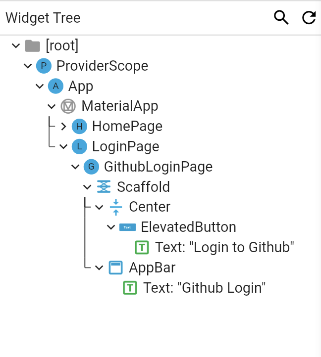

# 6章 状態管理

AccessTokenの取得ができましたが、他の画面やウィジェットなど、アプリ全体で必要となるグローバルな状態はどのように管理すれば良いのでしょうか。

Flutterには`InheritedWidget`という、下位のウィジェットから上位のウィジェットにアクセスするための特別なウィジェットが用意されています。
この`InheritedWidget`をラップした`riverpod`というパッケージを使って、LoginPageで取得したAccessTokenをグローバルな状態として管理してみましょう。

(flutterの状態管理パッケージで有名なものに `provider`　があります。どちらも同様の人間がメイン開発していて `riverpod` の課題点を解消した後継パッケージのようなので今後はこちらを利用するのがよさそうです。)

## riverpodを利用して複数の場所からステート（状態）にアクセスする
### riverpodパッケージの追加

まずは、`riverpod`パッケージを追加します。 3タイプのパッケージがありますが今回は基本的な`flutter_riverpod` を利用します。

```bash
flutter pub add flutter_riverpod
```

まずはじめにウィジェットツリーのルートに`ProviderScope`を含めることで、配下のウィジェットで`riverpod`を利用できる様になり`Provider`なども利用できる様になります。
```dart
runApp(
  const ProviderScope(
    child: App(),
  )
);
```

### 状態管理クラスを作る(任意の場所から状態を管理できる様にする)
`riverpod`はの前身パッケージの名称にもなった [Providers](https://riverpod.dev/docs/concepts/providers) という概念があります。 Providerにはいくつか種類がありますが、ここでは `StateNotifier` と `StateNotifierProvider` を使います。
>StateNotifierProvider は StateNotifier（Riverpod が依存する state_notifier パッケージのクラス）を監視し、公開するためのプロバイダです。 この StateNotifierProvider および StateNotifier は、ユーザ操作などにより変化するステート（状態）を管理するソリューションとして Riverpod が推奨するものです。

AccessTokenという状態を持つ `StateNotifier`クラスを作ります。StateNotifierはstateを持っていてジェネリクスで指定した型となります。stateは書き換え可能です。
<!-- 
`provider`の使い方には色々ありますが、シンプルな使い方の`ChangeNotifier`と、`ChangeNotifierProvider`を使うことにします。
`ChangeNotifier`は、購読しているウィジェットに対して変更を通知する機能を持ちます。一方で`ChangeNotifierProvider`は、配下のウィジェットに対して、特定の`ChangeNotifier`に対するアクセスする手段を提供してくれるウィジェットです。 -->
```dart
//access_token_provider.dart
class AccessTokenNotifier extends StateNotifier<String?>{
  AccessTokenNotifier() : super(null);

  void setToken(String accessToken){
    state = accessToken;
  }
}
```

つづいて、`StateNotifierProvider`クラスを作り`StateNotifier`を監視/操作可能にします。
```dart
//access_token_provider.dart
final accessTokenProvider = StateNotifierProvider<AccessTokenNotifier, String?>((ref) {
  return AccessTokenNotifier();
});
```

### WidgetからProviderにアクセスする

先ほど作ったProviderにアクセスする前に、FlutterのDevTools>`Widget Inspector`を利用しウィジェットツリーを見てみます。VSCodeの場合は`Cmd + Shift + P`でコマンドパレットを開き、`devtools`と入力すると表示できます。



HomePageや画面遷移した際に追加されたLoginPageなどは、ProviderScope>App>Material配下に配置されています。
ProviderScopeは配下であれば先ほど作ったProviderにアクセスできます。

それでは、実際に`GithubLoginPage` から `accessTokenProvider` にアクセスしてみます。
通常のウィジェットでは ref を使用することができないため、`StatelessWidget`や`StatefulWidget` を `ConsumerWidget`や`ConsumerStatefulWidget`に置き換えます。

`GithubLoginPage`は`StatefulWidget`なので`ConsumerStatefulWidget`に置き換えることで[`ref`](https://riverpod.dev/docs/concepts/reading/#obtaining-a-ref-object)を使えるようになりプロバイダと様々なやり取りを行えるようになります。
```dart
class GithubLoginPage extends ConsumerStatefulWidget { //ConsumerStatefulWidgetに置換

class _GithubLoginState extends ConsumerState<GithubLoginPage> { //ConsumerStateに置換
```

##### ステート(状態)を操作する

`LoginPage`にて accessTokenProvider を使用して、AccessTokenNotifierのaccessTokenに値をセットします。\
(`ref.read(Provider)` はProviderの値を取得やメソッドを呼び出しステート(状態)を操作に利用します。)

```dart
final accessTokenProviderNotifier = ref.read(accessTokenProvider.notifier);
accessTokenProviderNotifier.setToken(client.credentials.accessToken);
```

##### ステート(状態)の監視を行う

新規の画面`GithubInfoPage`を作り、AccessTokenNotifier の値を監視UIに反映させましょう。\
(`ref.watch(Provider)` はProviderの値の監視に利用します。)

```dart
//github_info_page.dart
import 'package:app/stores/access_token_provider.dart';
import 'package:flutter/material.dart';
import 'package:flutter_riverpod/flutter_riverpod.dart';

class GithubInfoPage extends ConsumerWidget {
  const GithubInfoPage({Key? key}) : super(key: key);

  @override
  Widget build(BuildContext context, WidgetRef ref) {
    final accessToken = ref.watch(accessTokenProvider);

    return Scaffold(
      appBar: AppBar(title: const Text("Github")),
      body: Column(
        children: [
          Text(accessToken ?? "トークンが空"),
        ],
      ),
    );
  }
}
```

### データ永続化
これで、AccessTokenを取得してログイン状態を作ることができました。しかしアプリを再起動すると、ログイン状態は失われてしまいます。Webブラウザではログイン状態をセッションの保存で実現していました。モバイルアプリでは、ローカルストレージにAccessTokenを保存することでログイン状態を保存しデータ永続化するこでアプリが終了しても失われない様にしましょう。

AccessToken の様な機密情報は暗号化された状態で安全にデータを保存する必要があり、`flutter_secure_storage`はデータを安全なストレージに保存する機能を提供するパッケージです。プラットフォームによって安全なストレージの定義は異なります、`flutter_secure_storage`ではiOS/MacOSの場合はKeyChain、AndroidならEncryptedSharedPreferencesといったプラットフォームで安全とされている機能を内部で利用しているようです。

また、macOSで`flutter_secure_storage`を利用する場合、Apple Developerの登録と証明書等の設定済みでないとKeychainを利用できずデータの保存取得が行えません。\
とりあえずmacOSで永続化を行いたい場合は`shared_preferences`パッケージを使い平文で保存して開発しましょう。世界に公開するアプリとなる場合はセキュアな場所に保存しましょう。

#### flutter_secure_storageを追加する

```bash
flutter pub add flutter_secure_storage
```

#### SecureStorageに書き込む

SecureStorageに保存/取得を行うクラスを作ります。

```dart
//secure_storage.dart
import 'package:flutter_secure_storage/flutter_secure_storage.dart';

class SecureStorage {
  static const _key = "AccessToken";

  static Future<void> saveAccessToken(String accessToken) async {
    const storage = FlutterSecureStorage();
    await storage.write(key: _key, value: accessToken);
  }

  static Future<String?> getAccessToken() async {
    const storage = FlutterSecureStorage();
    final accessToken = await storage.read(key: _key);

    return accessToken;
  }
}
```

続いて、`GithubLoginPage`で AccessToken を取得した際に、secure_storageに保存する処理を追加します。

```dart
final accessToken = client.credentials.accessToken;
final accessTokenProviderNotifier = ref.read(accessTokenProvider.notifier);
accessTokenProviderNotifier.setToken(accessToken);
await SecureStorage.saveAccessToken(accessToken); //追加
```

#### SecureStorageから読み込む

上でAccessTokenを永続化することはできました。今度はアプリ起動時にAccsessTokenを取り出しAccessTokenNotifierに状態を保持しましょう。

main.dartのrootウィジェット初期化時に処理を行いProviderにアクセスしたいので、Appウィジェットを`ConsumerStatefulWidget`に変更します。

`StatefulWidget`ではinitState()という初回ビルド時のみ呼ばれるメソッドを利用できます。
ただし、SecureStorageからデータを読み込むreadメソッドは非同期となっておりinitState()内部では行えません。\
`WidgetsBinding.addPostFrameCallback`をinitState()内部で利用し非同期処理を実行できる様にしています。

```dart
//main.dart
class App extends ConsumerStatefulWidget {
  const App({Key? key}) : super(key: key);

  @override
  ConsumerState<ConsumerStatefulWidget> createState() => _AppState();
}

class _AppState extends ConsumerState<App> {

  @override
  void initState() {
    super.initState();

    WidgetsBinding.instance.addPostFrameCallback((timeStamp) async { //ここ
      final accessToken = await SecureStorage.getAccessToken();
      if (accessToken != null) {
        final accessTokeNotifier = ref.read(accessTokenProvider.notifier);
        accessTokeNotifier.setToken(accessToken);
      }
    });
  }
...
```

これで、アプリ起動時にAccessTokenを復元できるようになりました！


## アプリからREST APIにリクエストする (任意)

APIリクエストのREST API版のコードを雑に残しておきます。

```dart
//rest_requests.dart
import 'dart:convert';
import 'package:http/http.dart' as http;

class RestRequests {
  late final http.Client _client;
  late final Map<String, String>? _headers;

  RestRequests({String? accessToken}) {
    _client = http.Client();
    _headers = {
      'Authorization': 'token $accessToken',
      'Accept': 'application/vnd.github+json'
    };
  }

  Future<void> postGist() async {
    String path = "/gists";

    final params = {
      "description": "Test",
      "public": "true",
      "files": {
        "README.md": {"content": "Hello World"}
      }
    };

    final uri = Uri.https(
      "api.github.com",
      path,
    );

    final response =
        await _client.post(uri, headers: _headers, body: json.encode(params));
  }
}

```
