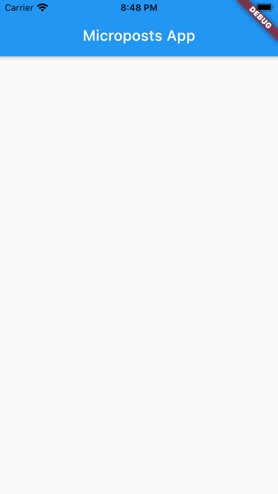
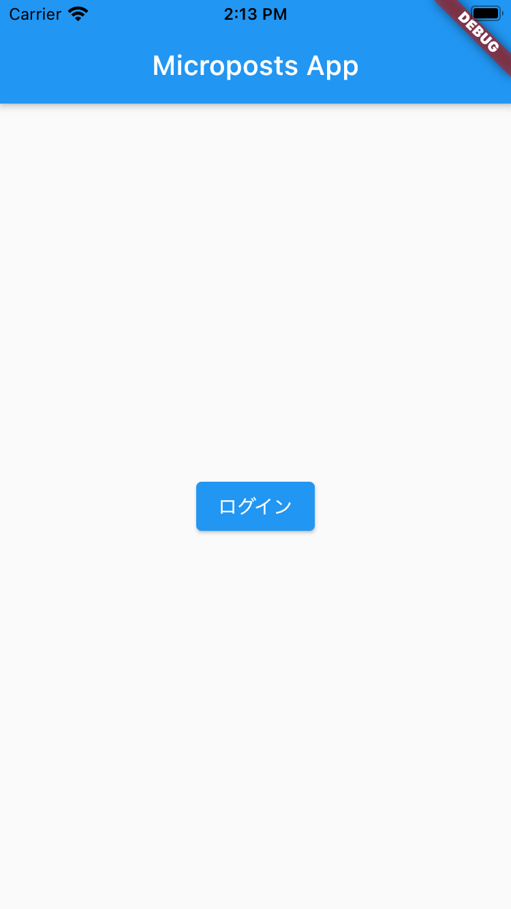
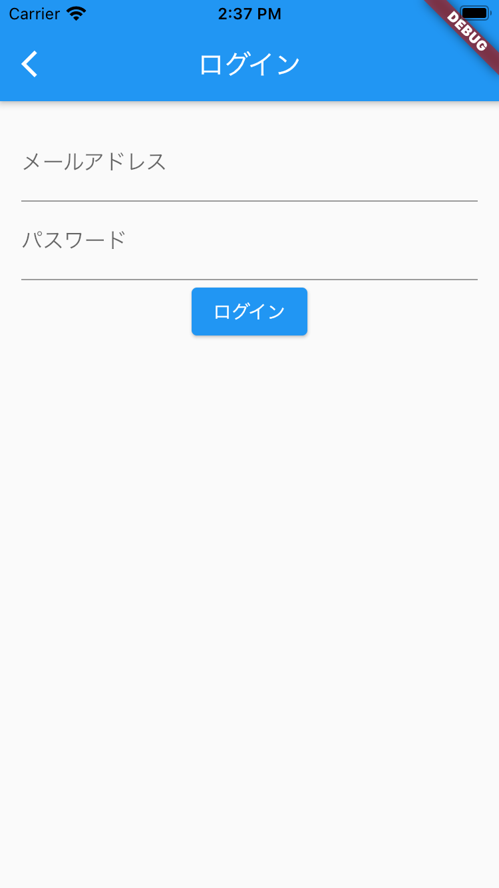

# 28章 FlutterでMicropostsアプリを作る

## Flutterプロジェクトの作成

`app_start`ディレクトリに移動し、Flutterプロジェクトを作成するコマンドを実行します。

このチュートリアルでは、以下のバージョンを使用します。先に進む前に`flutter --version`で確認しておいてください。

```bash
$ flutter --version

Flutter 2.2.0 • channel stable • ssh://git@github.com/flutter/flutter.git
Framework • revision b22742018b (8 days ago) • 2021-05-14 19:12:57 -0700
Engine • revision a9d88a4d18
Tools • Dart 2.13.0
```

もしバージョンが異なる場合は、Flutterをインストールしたディレクトリに移動し、`git checkout 2.2.0`を実行しましょう。
また、`flutter doctor`コマンドで、問題がないことも確認しておきましょう。

```
$ flutter doctor
`Doctor summary (to see all details, run flutter doctor -v):
[✓] Flutter (Channel stable, 2.0.2, on Mac OS X 10.15.7 19H2 darwin-x64, locale ja-JP)
[✓] Android toolchain - develop for Android devices (Android SDK version 30.0.2)
[✓] Xcode - develop for iOS and macOS
[✓] Chrome - develop for the web
[✓] Android Studio (version 4.1)
[✓] Android Studio (version 4.1)
[✓] VS Code (version 1.55.2)
[✓] Connected device (3 available)
```

それではプロジェクトを作成します。名前は`microposts_app`にします。

```bash
$ flutter create microposts_app

...
All done!
In order to run your application, type:

  $ cd microposts_app
  $ flutter run

To enable null safety, type:

  $ cd microposts_app
  $ dart migrate --apply-changes

Your application code is in microposts_app/lib/main.dart.
```

Null Safetyを有効にするためには、コマンドを実行する必要があります。
Null Safetyの詳細については以下のページを参照すると良いでしょう。

https://dart.dev/null-safety

```
$ cd microposts_app
$ dart migrate --apply-changes
```

生成されたエントリポイントのファイル`lib/main.dart`にはサンプルコードが記述されていますが、使用しないので消してしまって構いません。

```dart
import 'package:flutter/material.dart';

void main() {
  runApp(MyApp());
}

class MyApp extends StatelessWidget {
  @override
  Widget build(BuildContext context) {
    return Container();
  }
}
```

それでは、まずログイン機能から実装を行います。
MyAppを変更し、マテリアルデザインの見た目と機能を提供してくれる`MaterialApp`と`Scaffold`を組み合わせて、アプリ起動時の画面の見た目を変更します。

```dart
class MyApp extends StatelessWidget {
  @override
  Widget build(BuildContext context) {
    return MaterialApp(
      title: "MicropostsApp",
      home: Scaffold(
        appBar: AppBar(
          title: Text('Microposts App'),
        ),
        body: Container(),
      ),
    );
  }
}
```



まずは画面中央にログインボタンを設置します。`MaterialApp`の`home`を切り出して、新しいウィジェットとして`Home`を作成します。

```dart
class MyApp extends StatelessWidget {
  @override
  Widget build(BuildContext context) {
    return MaterialApp(
      title: "MicropostsApp",
      home: Home(),
    );
  }
}

class Home extends StatelessWidget {
  const Home({Key? key}) : super(key: key);

  @override
  Widget build(BuildContext context) {
    return Container(
      child: Scaffold(
        appBar: AppBar(
          title: Text('Microposts App'),
        ),
        body: Center(
          child: ElevatedButton(
            child: Text("ログイン"),
            onPressed: () {
              // TODO: ボタンを押したら、ログイン画面に遷移する
            },
          ),
        ),
      ),
    );
  }
}

```



ボタンの設置が完了したら、遷移先の画面を作っていきましょう。`lib/login_page.dart`を作成します。

```dart
import 'package:flutter/material.dart';

class LoginPage extends StatelessWidget {
  @override
  Widget build(BuildContext context) {
    return Scaffold(
      appBar: AppBar(
        title: Text("ログイン"),
      ),
      body: Container(
        margin: EdgeInsets.all(16),
        child: Column(
          children: [
            TextFormField(
              decoration: InputDecoration(
                labelText: "メールアドレス",
                hintText: "email@example.com",
              ),
            ),
            TextFormField(
              obscureText: true,
              decoration: InputDecoration(
                labelText: "パスワード",
                hintText: "****",
              ),
            ),
            ElevatedButton(
                onPressed: () {
                  // TODO: アクセストークンを取得するリクエストを送信
                },
                child: Text("ログイン")),
          ],
        ),
      ),
    );
  }
}
```

遷移先の画面ができたら、実際に遷移させてみましょう。`EvaluatedButton`の`onPressed`コールバックに実装します。

```dart
onPressed: () {
  Navigator.of(context).push(MaterialPageRoute(builder: (context) {
    return LoginPage();
  }));
},
```

`Navigator`は画面の遷移を提供してくれるクラスです。遷移の方法はいくつかありますが、ここでは`MaterialPageRoute`を使用します。

https://api.flutter.dev/flutter/widgets/Navigator-class.html
https://api.flutter.dev/flutter/material/MaterialPageRoute-class.html

実装できたら、ログインボタンを押してみましょう。ログイン画面に遷移できるはずです。



次はログインフォームの実装を行います。ログインにはメールアドレス、パスワードが必要です。文字の入力状態をウィジェット内で保存できるように、`StatefulWidget`を使って書き直してみましょう。

```dart
import 'package:flutter/material.dart';
import 'package:microposts_app/validator.dart';

class LoginPage extends StatefulWidget {
  LoginPage({Key? key}) : super(key: key);

  @override
  _LoginPageState createState() => _LoginPageState();
}

class _LoginPageState extends State<LoginPage> {
  String email = "";
  String password = "";

  @override
  Widget build(BuildContext context) {
    return Scaffold(
      appBar: AppBar(
        title: Text("ログイン"),
      ),
      body: Container(
        margin: EdgeInsets.all(16),
        child: Column(
          children: [
            TextFormField(
              decoration: InputDecoration(
                labelText: "メールアドレス",
                hintText: "email@example.com",
              ),
              autovalidateMode: AutovalidateMode.onUserInteraction,
              validator: Validator.emailValidator,
              onChanged: (value) {
                setState(() {
                  this.email = value;
                });
              },
            ),
            TextFormField(
              obscureText: true,
              decoration: InputDecoration(
                labelText: "パスワード",
                hintText: "****",
              ),
              autovalidateMode: AutovalidateMode.onUserInteraction,
              validator: Validator.passwordValidator,
              onChanged: (value) {
                setState(() {
                  this.password = value;
                });
              },
            ),
            _loginButton(context),
          ],
        ),
      ),
    );
  }

  Widget _loginButton(BuildContext context) {
    if (Validator.isValidEmail(this.email) &&
        Validator.isValidPassword(this.password)) {
      return ElevatedButton(
        onPressed: () {},
        child: Text("ログイン"),
      );
    }

    return ElevatedButton(
      onPressed: () {},
      child: Text("ログイン"),
      style: ElevatedButton.styleFrom(primary: Colors.transparent),
    );
  }
}
```

`Validator`は`lib/validator.dart`ファイルを作成して、そちらに実装します。

```dart
class Validator {
  static final emailFormat = RegExp(
      r"^[a-zA-Z0-9.a-zA-Z0-9.!#$%&'*+-/=?^_`{|}~]+@[a-zA-Z0-9]+\.[a-zA-Z]+");

  static String? emailValidator(String? email) {
    if (email == null) return "メールアドレスを入力してください。";

    if (email.isEmpty) {
      return "メールアドレスを入力してください。";
    }
    return emailFormat.hasMatch(email) ? null : "メールアドレスのフォーマットが間違っています。";
  }

  static bool isValidEmail(String? email) {
    if (email == null) return false;

    return emailFormat.hasMatch(email);
  }

  static String? passwordValidator(String? password) {
    if (password == null) return "パスワードを入力してください。";

    return password.isEmpty ? "パスワードを入力してください。" : null;
  }

  static bool isValidPassword(String? password) {
    if (password == null) return false;

    return password.isNotEmpty;
  }
}
```


ここで注目すべきポイントは、`_loginButton`です。

```dart
Widget _loginButton(BuildContext context) {
  if (Validator.isValidEmail(this.email) &&
      Validator.isValidPassword(this.password)) {
    return ElevatedButton(
      onPressed: () {
        // TODO: アクセストークンを取得するリクエストを送信する
      },
      child: Text("ログイン"),
    );
  }

  return ElevatedButton(
    onPressed: () {
      // メールアドレスまたはパスワードのフォーマットが正しくないため、何もしない
    },
    child: Text("ログイン"),
    style: ElevatedButton.styleFrom(primary: Colors.transparent),
  );
}
```

Flutterでは、`setState`が呼ばれる度にウィジェットが再描画されます。そして、再描画は常に最新の値を使って行われます。
今回のケースでは、`this.email`, `this.password`はフォームの値が変更される度に`setState`と共に更新され、再描画が行われます。つまり、メールアドレスとパスワードのフォーマットが正しくない間は押しても何も起こらないボタンが描画され、どちらも正しいフォーマットが入力されるとアクセストークンを取得するリクエストを送信するボタンを描画します。

Flutterが採用している宣言的UIプログラミングを活用すれば、状態を判定する複雑な処理を減らし、可読性の高いコードを書くことができます。

ログインフォームの実装ができたので、次は実際にアクセストークンの取得リクエストを送ってみましょう。
HTTPリクエストには、`http`パッケージを使用します。また、`client_id`と`client_secret`を必要とするので、`pubspec.yaml`に以下の行を追記し、`flutter pub get`でパッケージを取得します。

```bash
$ flutter pub add flutter_dotenv
```

```yaml
dependencies:
  flutter:
    sdk: flutter
  http: ^0.13.3
  flutter_dotenv: ^4.0.0-nullsafety.0

flutter:
  // 省略
  assets:
  - .env
```

Flutterプロジェクトのルートに`.env`ファイルを作成します。このファイルに`client_id`と`client_secret`を記述するため、`.gitignore`でこのファイルをコミット対象から除外しておきましょう。
作成したら、以下のように記述します。

```
CLIENT_ID=<client_id>
CLIENT_SECRET=<client_secret>
```

記述ができたら、Flutterからこれらの変数を取得できるようにします。

`lib/main.dart`を開き、`runApp`の前に以下のような実装を行います。`DotEnv.load`が完了するまで待つ必要があり、`main`関数を`async`に変更し、`await`で完了を待ちます。

```dart
import 'package:flutter_dotenv/flutter_dotenv.dart' as DotEnv;

void main() async {
  await DotEnv.load();
  runApp(MyApp());
}
```

注意点として、Hot Reloadは`main`関数の変更を反映してくれないため、`main`関数に何か変更を加えた場合はHot Restartあるいはアプリの再起動を行う必要があります。

`.env`のロードができるようになったので、実際にリクエストを送信してみます。`lib/login_page.dart`を編集します。  
Androidエミュレータで開発している場合は、`localhost`はエミュレータ自身を指す意味になります。https://developer.android.com/studio/run/emulator-networking  
なので、`localhost:3000`ではなく`10.0.2.2:3000`を指定してあげる必要があります。

```dart
onPressed: () async {
  final client = http.Client();
  final params = {
    "grant_type": "password",
    "username": this.email,
    "password": this.password,
    "client_id": DotEnv.env["CLIENT_ID"],
    "client_secret": DotEnv.env["CLIENT_SECRET"],
    "scope": "read write"
  };
  final uri = Uri.http(
    "localhost:3000",
    "/oauth/token",
  );
  final response =
      await client.post(uri, body: params).catchError((error) {
    final snackBar = SnackBar(
      content: Text("ログイン中にエラーが発生しました。"),
      action: SnackBarAction(
        label: "閉じる",
        onPressed: () {},
      ),
    );
    ScaffoldMessenger.of(context).showSnackBar(snackBar);
  });

  if (response.statusCode >= 400) {
    final snackBar = SnackBar(
      content: Text("ログインできませんでした。メールアドレスとパスワードが正しいか確認してください。"),
      action: SnackBarAction(
        label: "閉じる",
        onPressed: () {},
      ),
    );
    ScaffoldMessenger.of(context).showSnackBar(snackBar);
  }
},
```

メールアドレス、パスワードが正しければ、アクセストークンを含んだレスポンスが受け取れるはずです。
アクセストークンが取得できない場合は、`response.statusCode`や`response.body`をチェックしてみると良いでしょう。

```json
response.statusCode
401
response.body
{"error":"invalid_client","error_description":"Client authentication failed due to unknown client, no client authentication included, or unsupported authentication method."}
```
