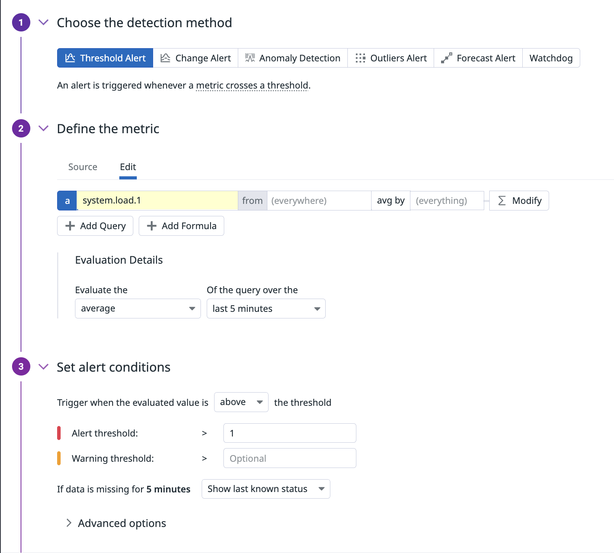

# 可観測性と監視

## 可観測性（オブザーバビリティ、Observability、O11y）とは

可観測性（かかんそくせい、オブザーバビリティ、Observability、O11y）とはシステムの内部状態をシステムの出力によってどれだけ推測できるかを表す尺度です。  
オブザーバビリティはもともとは制御工学から生まれた概念です。現代のソフトウェアシステムにおけるオブザーバビリティでは、例えば次の状態を「オブザーバビリティが高い」と表現します。

- あなたのシステムに何かの異常が起きた際に、システムに変更を加えずにその異常の原因を素早く切り分けられる
- あなたのサービスにアクセスしたユーザーのうち一人が「エラーが発生した」と報告してきた際に、そのユーザーの体験とエラーが起きた原因を説明できる
- システムのパフォーマンスを任意の切り口で収集し、分析できる

可観測性を高めるためには、システムの状態をシステム外部に出力すること、すなわち「テレメトリー」を収集することが重要です。テレメトリーは、システムの状態を記録するための情報です。テレメトリーを収集することで、システムの状態を可観測にし、システムの問題を素早く切り分けることができます。

## モニタリングとオブザーバビリティ

オブザーバビリティという考え方が普及する以前、人々はモニタリング（監視）と呼ばれる手法を用いてシステムを監視し、「システムの内部で何が起きているかを外部から理解できるようにする」ことを実現してきました。

モニタリングとは、あらかじめ決められた指標を定期的に収集・監視し、異常が発生した場合にアラートを出すことで、システムの健全性を保つための活動です。

Webシステムに対して行われる監視の例をいくつか挙げてみます。

- 外形監視
  - サービスのエンドポイントに実際にリクエストを送ってみて、想定通りのレスポンスが想定通りの時間内に返ってくるかを継続的に確認する
    - 例えば
      - `https://example.com/`にGETリクエストを送り、200 OKが1s以内に返ってくるか？
      - `https://staging.example.com/`にGETリクエストを送り、Google認証のページにリダイレクトされるか？
- ログ監視
  - サービスが出力するログを収集し、エラーや警告などの異常を検知する
    - 例えば
      - `ERROR`や`WARN`が含まれるログを監視する
      - 監査ログを監視しsudoの実行を検知する
- メトリクス監視
  - サービスが出力するメトリクスを収集し、異常を検知する
    - 例えば
      - マシンのCPU使用率が80%を超えたらアラートを出す
      - マシンのメモリ使用率が90%を超えたらアラートを出す

従来のモノリシックな（単一サーバ上で動作する）システムでは、トラブルが発生した際にサーバーにログインしてログを確認したり、コマンドを実行したりすることで、比較的容易にシステムの状況を把握できました。

しかし、近年はマイクロサービスやサーバーレスアーキテクチャの採用、クラウドサービスの活用、さらにはクラウドネイティブアーキテクチャの普及によって、システムはより複雑かつ分散しています。
例えば、アプリケーションはコンテナ化され、それらのコンテナ群はオーケストレーション機能によって動的に生成・削除されます。モノリシックなアプリケーションはマイクロサービスに分割され、サービス同士は相互に依存するようになり、その依存関係を把握することは現実的でなくなります。サービス間の通信はサービスメッシュによって管理され、インフラは抽象化されてサーバーレスとして扱われるようになり、従来のように直接SSHでアクセスすることもできなくなっています。

このような複雑な構成の分散アプリケーションでは、これまで予期しなかったような問題が起きることがあります。従来のモニタリング手法では、このような複雑な状況での問題分析は不可能ではないものの、とても難しいものになります。

そこで、複数のサービスから取得した情報を組み合わせて分析を行うことで、予期しないトラブルにも対応できるようにすることを目的として、オブザーバビリティという考え方が生まれました。

モニタリングが既知の未知に対するリアクティブなアプローチであるのに対して、オブザーバビリティは未知の未知に対するプロアクティブなアプローチであると説明されます。

## オブザーバビリティの重要性

可観測性の向上はシステムの信頼性を向上させるための一つの手段です。現代のシステム開発において、複数の事情からオブザーバビリティが重要視されるようになりました。

### デバッグにおける組織的暗黙知

たとえば、あなたがエンジニアとして特定のシステムの担当部署に配属されたと想定してください。その部署には経験豊富な先輩がいます。おや、システムからアラートが鳴りました。先輩は長年の**蓄積された経験によって生まれた勘**から、システムの問題点を推測し、問題を解決しました。傍目には何が起きたかまったく分かりませんでした。先輩に対応の言語化を求めると、「このアラートが出たときは大抵アレを再起動したら復旧する」と言われました。

さて、その先輩は退職しました。おや、またアラートが鳴りました。先輩が解決していたアラートとは別のアラートです。ユーザーからの問い合わせが増え、ユーザーが困っているということは分かってきました。あなたには経験も勘も備わっていません。外から観測できるシステムの指標はありません。......さあ、どうしましょうか。

---

オブザーバビリティが低いシステムにおいて、最高のデバッガーは組織の中で最も経験豊富なエンジニアです。しかし、往々にして、システムの寿命はエンジニアの寿命よりも長いです。システム終了イベントよりも、エンジニアの退職イベントや休暇イベントの方が頻繁に起こりうるという意味です。つまり、システムの可観測性が低い場合、組織としてのデバッグ能力は属人性が高いため持続的でないです。

オブザーバビリティが高いシステムにおいて、最高のデバッガーは組織の中で**最も好奇心が強いエンジニア**です。テレメトリーのディメンション・カーディナリティが豊富であれば、探索的な質問によって仮説検証を高速で繰り返すことが可能です。

すなわち、組織的なデバッグ能力を特殊な個人の経験に依存せずに高めるためには、システムのオブザーバビリティを高めることが必要です。

### 現代のシステムは複雑すぎる

現代においては「クラウドネイティブ」という表現が枯れてきたのではないでしょうか。Cloud Native Computing Foundationによると、クラウドネイティブとは、組織がシステムの開発や運用においてクラウドコンピューティングの利点を活用するためのアプローチです。Cloud Native Computing Foundationはクラウドネイティブを次のように定義しています。

> Cloud native practices empower organizations to develop, build, and deploy workloads in computing environments (public, private, hybrid cloud) to meet their organizational needs at scale in a programmatic and repeatable manner. It is characterized by loosely coupled systems that interoperate in a manner that is secure, resilient, manageable, sustainable, and observable.

https://github.com/cncf/toc/blob/main/DEFINITION.md#definition

クラウドネイティブアーキテクチャによってシステムが高度化する一方で、そのシステムの複雑性は増大しています。

このような状況において、システムの内部状態を把握するためには十分な可観測性が必要になります。

### 具体的な効果
オブザーバビリティエンジニアリングによって以下のようなことが実現できるようになります。

- プログレッシブデリバリー（段階的なリリース）の効果測定や安全性の担保
- サービス間の依存関係の可視化
- SLI/SLO（サービスレベル指標/目標）への活用
- ユーザー行動分析によるユーザビリティ向上
- AIを活用した障害予測や運用支援

### DevOps, SREプラクティスの成熟

DevOpsはDevelopment（開発）とOperations（運用）を分離するのではなく統合することによってリリースまでのスピードを高めたりシステムの信頼性を高めたりするための文化です。
SREは、ソフトウェアエンジニアリングをシステム運用に適用することによって、サービスの高速なリリースを止めることなくサービスの信頼性を向上・維持するためのプラクティスです。

DevOpsやSREの成熟にしたがって、システムのオブザーバビリティがより重要視されるようになりました。

#### サービスレベル指標

SREプラクティスにおいてはサービスの信頼性をSLI（Service Level Indicator）として定量化することが一般的です。その指標をシステムから正確に測定するためには高いオブザーバビリティが必要になります。

#### インシデント管理と非難なきポストモーテム

システムの信頼性が大幅に毀損された際には、的確に対処することでシステムの信頼性を回復させることが求められます。また、ポストモーテムとしてインシデントの原因を分析し、再発防止策を考案・実装することは将来の信頼性向上につながります。これらの営みを高いレベルで行うためには高いオブザーバビリティが必要です。

#### リリースエンジニアリング

障害の大半はリリースによって引き起こされると言われます。
リリースエンジニアリングは、リリースによる信頼性の低下を防止するためのエンジニアリングです。たとえば、カナリアリリースによる漸進的なリリースや、フィーチャーフラグによるリリースの制御が挙げられます。
リリースエンジニアリングを行うためには、リリースの影響をテレメトリーで監視することが必要です。

## オブザーバビリティを支える主要なテレメトリー

この研修で取り扱う主要なテレメトリーは、「メトリクス」「ログ」「トレース」です。

それぞれの要素についてはstudyページとworkshopページで詳しく説明します。

## よく使われるオブザーバビリティツール

世間的に広く使われており、かつペパボでも使用しているツールを挙げます。

### Datadog

https://www.datadoghq.com/ja/

ログ、トレース、メトリクスの収集・可視化だけでなく、アラート通知やインシデント管理、クラウドセキュリティの管理など幅広い機能を提供するSaaSです。

### New Relic

https://newrelic.com/jp

統合型オブザーバビリティプラットフォームを提供するSaaSです。

### Mackerel

https://mackerel.io/ja/

株式会社はてなが開発・運営するサーバー監視サービスです。

### Grafana

https://grafana.com/

オープンソースの可視化ツールで、さまざまなデータソースからのメトリクスを統合し、カスタマイズ可能なダッシュボードを作成できます。エコシステムが豊富で、PrometheusやLoki、Tempoなどのデータソースに対応しています。

### Datadogでの監視

Datadog Monitorsを利用することで、監視対象に異常がある際に、アラートと通知ができます。

テスト用Monitor設定はこちら
https://app.datadoghq.com/monitors/175736743 

こちらでは、以下のようなことを設定しています。
- 何を監視？
  - すべてのホストの1分ロードアベレージ（system.load.1）
- どの期間？
  - 過去5分間の平均値
- どうやってアラート？
  - しきい値1.0を超えたらアラート

他にも、Datadog のアラート機能では、メトリクス、インテグレーションの可用性、ネットワークエンドポイントなどをアクティブにチェックするモニターを作成することができます。

モニター設定の参考はこちら
https://docs.datadoghq.com/getting_started/monitors/

モニターの種類の参考はこちら
https://docs.datadoghq.com/monitors/types/
