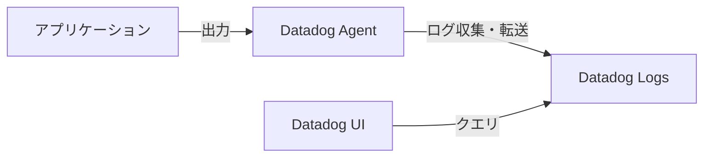

# ログ

ログは、可観測性を高めるための主要なシグナルの一つです。システムがテキストとして出力する情報が「ログ」です。

## よくあるログ

よく「ログ」と呼ばれるものには次のような種類があります。

- アクセスログ  
  - Webサーバーにアクセスがあったときに記録されるログ  
- エラーログ  
  - システムがエラーを検知したときに記録されるログ  
- デバッグログ  
  - デバッグのための情報を出力するログ  

## Datadog Logs

Datadogは、ログの収集・検索・可視化・アラートのすべてを一貫して行えるSaaS型のオブザーバビリティプラットフォームです。

Datadog Logsは、以下のような流れでログを扱います：

### ログの流れ



ログの転送先としてはこの他にも、OpenTelemetry Colloctorへ転送することも可能です。今回の研修ではDatadog Agent経由で送ります。

## ログの構造化

### 「構造化」とは

構造化とは、情報を機械的に処理しやすくするために、データを予め定義された形式や規則に従って整理し、組み立てることです。

たとえば次のログは非構造化されています。
```
14:30:15 User john.doe logged in from 192.168.1.100  
14:30:20 Basic authentication accepted by user john.doe  
14:30:27 Request succeeded response_time=0.5s
```

このログを構造化しようとすると次のようになります。
```json
[
  {
    "timestamp": "14:30:15",
    "event": "login",
    "user": "john.doe",
    "ip": "192.168.1.100"
  },
  {
    "timestamp": "14:30:20",
    "event": "auth",
    "method": "basic",
    "user": "john.doe"
  },
  {
    "timestamp": "14:30:27",
    "event": "request",
    "status": "success",
    "response_time": 0.5
  }
]
```

この例ではJSON形式を用いてログを構造化しました。

DatadogはJSON形式のログを受け取ると、自動的にそれをパースします。これにより、response_timeのような数値は数値として、userのような文字列は文字列としてデータ型が維持されるため、後々の検索や集計で「500ms以上かかったリクエスト」のような範囲指定が可能になります。

その他のテキスト形式の場合は、Grokパーサーを利用して、手動で属性とデータ型を定義する必要があります。

### 構造化されたログがあるとオブザーバビリティが大幅に高まる

構造化イベントは、オブザーバビリティの構成要素です。オブザーバビリティが高くあるためには、システムの出力からシステムの内部状態を推測できる必要があります。システムがどれだけ斬新で奇妙な状態でも、その内部状態についての質問に答えられなければいけません。
あらゆる質問に答えるためには、複数のテレメトリーを組み合わせるのが効率的でしょう。データが構造化されていれば、ソフトウェアが機械的にデータを処理することが可能になります。処理されたデータを組み合わせることで求める情報を探索できるようになります。 例えば、特定のユーザーによる特定のIPからのリクエストを探りたい場合を考えます。このとき、ログが構造化されていれば、user=hogeかつip=xx.xx.xx.xxのログを機械的に検索できます。構造化されていないログでは効率的な検索が難しいです。 つまり、構造化されたログはオブザーバビリティを高めるのです。

また、どれだけ細かい粒度の質問に対しても的確にテレメトリーを組み合わせて答えるためには、各種テレメトリーのディメンションもカーディナリティも高くある必要があります。ディメンションはデータのキーの数のことです。カーディナリティはデータのユニーク度のことです。ディメンションとカーディナリティが高いほど、探索をより詳細に精密に行うことができます。
