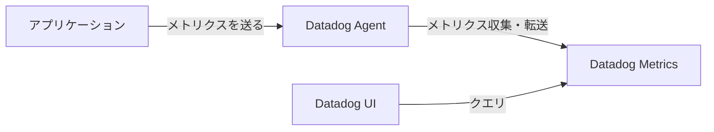

# メトリクス

メトリクスは、可観測性を高めるための主要なシグナルの一つです。システムのデータを定量的に示すシグナルがメトリクスと呼ばれます。  
「ログ」「トレース」と合わせるなら英語的には「メトリック」と呼ばれるはずですが、日本語では「ログ」「トレース」「メトリクス」と呼ばれることが多いです。不思議ですね。

## よくあるメトリクス

例えば次のようなメトリクスがよく使われます。世にある観測ツールをインストールすると自動的にこれらのメトリクスが収集されることが多いです。

- CPU使用量
- メモリ使用量
- ディスク使用量
- ネットワーク通信量
- リクエスト数
- レスポンス時間

### Datadog Agent

Datadog Agentがインストールされると、ノードやコンテナからリソースメトリクス（CPU、メモリ、ネットワークなど）を自動で収集します。
これはKubernetesクラスタの主要コンポーネント（APIサーバー、kubelet、kube-state-metricsなど）やコンテナランタイム（Docker、containerdなど）との連携が標準で組み込まれているため、特別な追加設定をしなくても、クラスタ全体や各コンテナの状態・パフォーマンス情報がDatadogに送信される仕組みになっています。

詳細はこちら
https://www.datadoghq.com/blog/monitoring-kubernetes-with-datadog/

### Datadogクエリ

https://docs.datadoghq.com/metrics/#querying-metrics

メトリクスの検索にはクエリを利用します。

クエリビルダーのサポートを受けながらクエリを書くのもよいでしょう。

例えば、「k8sクラスタのreadyなPodの数」を取得するクエリは次のようになります。

```
sum:kubernetes_state.pod.ready{kube_namespace:production,condition:true} by {kube_cluster_name}
```

### カスタムメトリクス

自分で発行したメトリクスをDatadogに収集させることもできます。
アプリケーションに固有の状態や性能を監視するためにexportするという使い方になるでしょう。

#### Metrics Type

- Counter
  - 単調増加する値
- Gauge
  - 増減する値
- Histgram
  - 値の分布
- UpDownCounter
  - 増減するカウンタ

exportする値に応じて適切なタイプを選びましょう。

#### Datadog Metrics

研修ではDatadog Agent OTLP ingestを利用しています。
OpenTelemetry SDKで上記のようなカスタムメトリクスを収集後、Datadog AgentによりDatadog対応のメトリクスにマッピングされます。

- Counter -> Count
- Gauge -> Gauge
- Histgram -> Distribution
- UpDownCounter -> Count

クエリ時は上記のマッピングされた値でクエリをしましょう。

詳しくはこちらに載っています
https://docs.datadoghq.com/metrics/open_telemetry/otlp_metric_types/?tab=sum

#### 今回研修で計装するカスタムメトリクスの流れ


