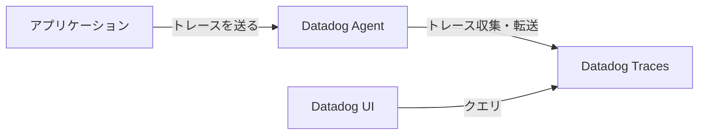

# トレース

トレースは、ソフトウェアデバッグの基本的な手法です。ソフトウェアの実行過程や、システム内でのデータの流れを追跡し記録する行為や記録されたものがトレースと呼ばれます。

## アプリケーショントレース

アプリケーショントレースは、単一のアプリケーション内での実行フローを追跡します。たとえば、次のような情報が得られます。

- HTTPリクエストを受け取ってからレスポンスを返すまでの間に発生するメソッドの呼び出し関係
- 各メソッドの実行時間
- エラーの発生箇所とエラーのスタックトレース

具体的なユースケースとしては、次のようなものがあります。

- パフォーマンスのボトルネックの特定
  - 「このリクエストでDBへの問い合わせが101回発生してるじゃん！そりゃ遅いわ！」
- エラーの原因の特定
  - 「エラーが出たという問い合わせが来たが、どのリクエストのどの関数でエラーが出ているんだろう？」

## 分散トレース

分散トレースは、複数のサービス間での実行フローを追跡します。現代のWebシステムにおいては一回のリクエストにおいて複数のサービスコンポーネントをまたがることが多いため、分散トレースが実装できているとデバッグが容易になります。たとえば、次のような情報が得られます。

- HTTPリクエストを受け取ってからレスポンスを返すまでの間に発生するサービス間のリクエストの呼び出し関係
- 各サービスの実行時間

## OpenTelemetry

OpenTelemetryは、可観測性のためのオープンソースプロジェクトです。OpenTelemetryは、トレース、メトリクス、ログを収集するためのライブラリを提供します。OpenTelemetryは、複数の言語に対応しており、各言語向けのSDKが提供されています。

https://opentelemetry.io/docs/languages/

2025年現在では、各言語においてトレース収集の実装はStableになっています。メトリクス・ログは言語によりまちまちです。そのためこの研修資料ではOpenTelemetryによるトレースの収集のみを扱います。

### OpenTelemeryがもたらした標準化の意義

従来のトレースにおいては、各ベンダーが独自のトレースライブラリを実装・提供していたため次のような課題がありました。

- ベンダーロックイン
  - 特定のベンダーのトレースライブラリを使っているため、他のツールに容易に乗り換えることができず、ポータビリティが低い
- ツールごとに学習コストが発生する

OpenTelemetryはオブザーバビリティスタックを抽象化・標準化しているため、ベンダーロックインを回避し、ツールごとの学習コストを削減することができます。例えばDatadogやMackerelなどのベンダーがOpenTelemetryをサポートする動きが出てきています。

https://docs.datadoghq.com/ja/opentelemetry/
https://hatena.co.jp/press/release/entry/2024/04/23/120000

## OTelの仕組み

https://opentelemetry.io/docs/concepts/ に書かれている内容のうち、workshopを進めていくのに必要なものを抜粋して説明します。
OpenTelemetryは、言語や実行環境に依らずテレメトリーを計装・収集するための標準化されたAPIやProtocolを定めています。

### OTelにおける主要な概念

- OpenTelemetry SDK
  - 言語ごとにテレメトリーの計装や収集を行うためのライブラリが提供されています
- OpenTelemetry Protocol（OTLP）
  - テレメトリーデータを送受信するために標準化されたプロトコルです
  - gRPCとHTTPの両方がサポートされています
- OpenTelemetry Collector
  - テレメトリーデータの受信・処理・送信を行うための中央コンポーネントです
  - 受信はOTLPを含む複数のフォーマットがサポートされています
  - 送信も複数のbackendにできます
- Propagation
  - ネットワークを跨いだサービス間でテレメトリーデータを追跡するための仕組みです

### OTel Tracingにおける主要な概念

- Trace
  - Spanの集合をTraceと呼びます
- Span
  - Trace内の操作単位がSpanです
  - Spanは開始時刻と終了時刻を持ちます
- Context
  - Spanの情報をサービス間で伝播させるための情報です
- Tracer Provider
  - Tracerを提供するfactoryです
- Tracer
  - TracerはSpanを作成します
- Tracer Exporter
  - Exporterは、作成されたTraceを他の箇所に送信します
  - 送信先は標準出力だったりOpenTelemetry Collectorだったりします

#### 今回研修で計装するトレースの流れ

