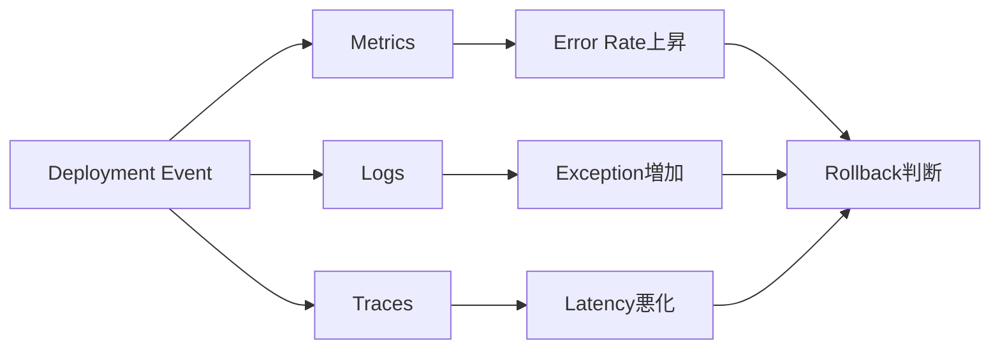
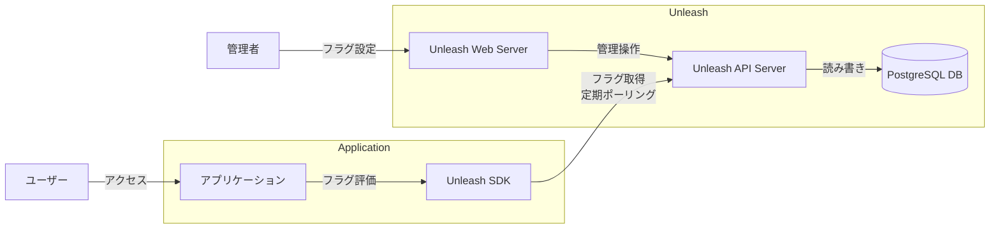

# 変更管理

> SREは、およそ70%のサービス障害は、動作中のシステムの変更によって生じていることを発見しました。

*- 『SRE サイトリライアビリティエンジニアリング ―Googleの信頼性を支えるエンジニアリングチーム』*

変更管理とは、システムへの変更を管理することです。オブザーバビリティの文脈では、変更の影響を分析可能にすることによって問題の早期発見と迅速な対応が可能になります。

## なぜ変更管理が重要なのか

現代においては、システム開発の場での継続的なデプロイメントが当たり前になりました。1日に何度もプロダクションへの変更が行われます。  
Googleの調査によると、**システム障害の約70%は何らかの変更に起因している**とされています。  
つまり、システムの安定性を保つためには、変更をいかに安全に管理するかが重要です。

Observabilityと組み合わせることで、以下のような価値を実現できます：

- 変更の影響を即座に可視化
- 問題の早期発見と原因特定
- 変更とインシデントの相関分析
- データによる自動化された変更管理

## 変更の種類と管理手法

### デプロイメント戦略

安全に変更をリリースするためのデプロイメント戦略には、例えば次のものがあります。

- Blue-Green Deployment
- Canary Deployment
- Rolling Update
- Feature Flags

#### 1. Blue-Green Deployment

本番環境を2つ（Blue/Green）用意し、新バージョンを片方にデプロイしてから切り替える手法です。問題があれば即座に元に戻せます。

#### 2. Canary Deployment

新バージョンを一部のユーザーやトラフィックにのみ適用し、問題がないことを確認してから全体に展開する手法です。リスクを最小化できます。

#### 3. Rolling Update

アプリケーションサーバーを順次更新していく手法です。Kubernetesなどのオーケストレーターで標準的にサポートされています。

#### 4. Feature Flags

コードはデプロイするが、機能の有効/無効を動的に制御する手法です。デプロイと機能リリースを分離できます。

## ObservabilityとChange Managementの統合

### 変更とメトリクスの相関

### Progressive Delivery

Observabilityデータを活用して、自動的にロールアウトを制御する手法です。

1. **メトリクスベースの判断**: エラー率やレイテンシを監視
2. **自動ロールバック**: 閾値を超えたら自動的に元に戻す
3. **段階的な展開**: 成功率に応じて展開速度を調整

## ベストプラクティス

### 1. 変更の最小化

一度に大きな変更を行うのではなく、小さく頻繁な変更を心がけます。問題の特定が容易になり、ロールバックも簡単になります。

### 2. 変更の可視化

すべての変更をダッシュボードに表示し、メトリクスと並べて見られるようにします。例えばDatadog APMでは、デプロイメントトラッキング機能によって新しいバージョンのデプロイを自動的に検出してannotationとして記録します。

ref: https://docs.datadoghq.com/ja/tracing/services/deployment_tracking/

### 3. 自動化とガードレール

人間の判断に依存しすぎず、自動的に安全性を確保する仕組みを作ります：
- 自動テスト
- カナリアデプロイメント
- 自動ロールバック

## ツール

ペパボでは、変更管理に次のツールが使われています。

- ArgoCD
- Argo Rollouts
- Unleash

この研修ではUnleashを使ってFeature Flagを管理します。

### この研修におけるUnleashと各アプリケーションの関係性

