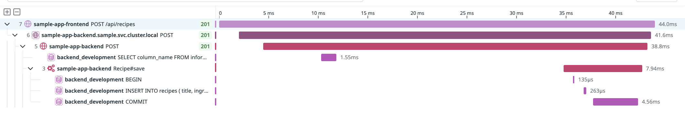

# トレース

## 3.1. トレースを出力してみよう

OTelエコシステムのSDKを使ってトレースを出力してみましょう。

https://opentelemetry.io/docs/languages/ruby/

各言語に対応したSDKが提供されています。チュートリアルも提供されているため、これに沿って進めていくのがよいでしょう。

## 3.2. トレースを収集してみよう

k8sクラスタにはDatadog Agentがインストールされています。
`monitoring`ネームスペースに`datadog-agent`というServiceがあり、収集用のポートが空いているのでそこにOTLP形式でトレースを送信してみましょう。うまく送信されればDatadog APMからトレースを確認できます。

参考：https://docs.datadoghq.com/opentelemetry/setup/otlp_ingest_in_the_agent

## 3.3. (Optional) 親子関係を持つトレースを出力してみよう

例えば、HTTPリクエストを受け取って、特定の関数を実行して、HTTPレスポンスを返すようなアプリケーションを考えます。このとき、HTTPリクエストからHTTPレスポンスまでの間に発生する関数の呼び出し関係をトレースに出力してみましょう。

## 3.4. (Optional) 分散トレースを収集してみよう

分散トレースを収集するためには、複数のサービス間でトレースを収集する必要があります。例えば、HTTPリクエストを受け取って、別のサービスにリクエストを送信して、そのレスポンスを返すようなアプリケーションを考えます。このとき、サービスを跨いだトレースに親子関係を持たせて収集してみましょう。

こちらはsampleアプリケーション。ざっくりと「sample-app-frontend」から「sample-app-backend」にリクエストされて、DBへクエリが発行されていることがわかる。

## 3.5. (Optional) ログとトレースを紐付けてみよう

ログとトレースを紐付けることで、ログからトレースをたどることができるようになります。例えば、ログにトレースIDを出力しておいて、そのトレースIDを使ってトレースを検索することができます。
